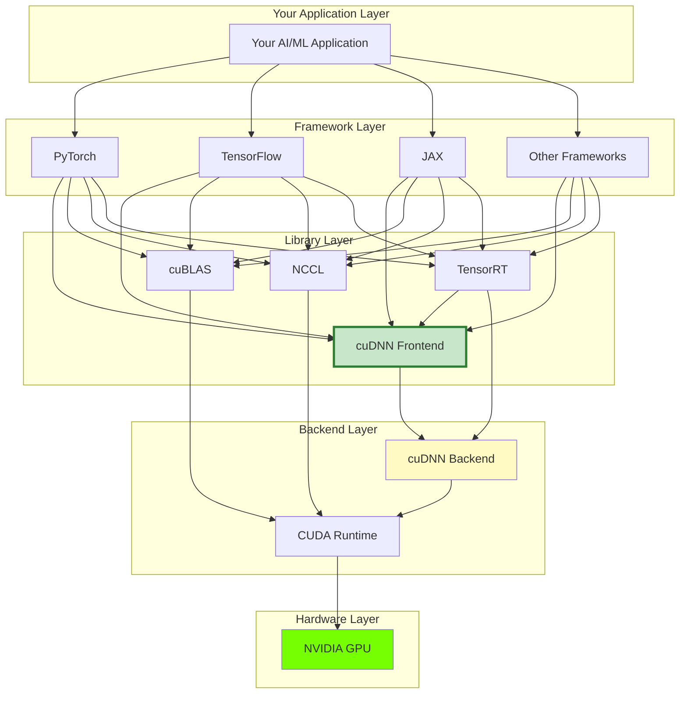
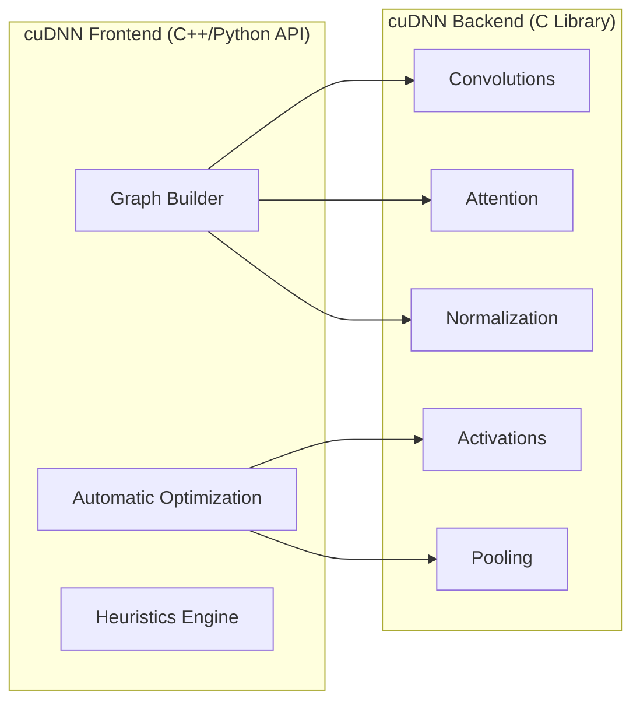
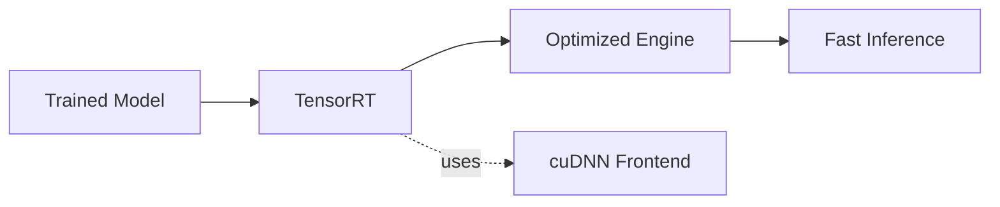
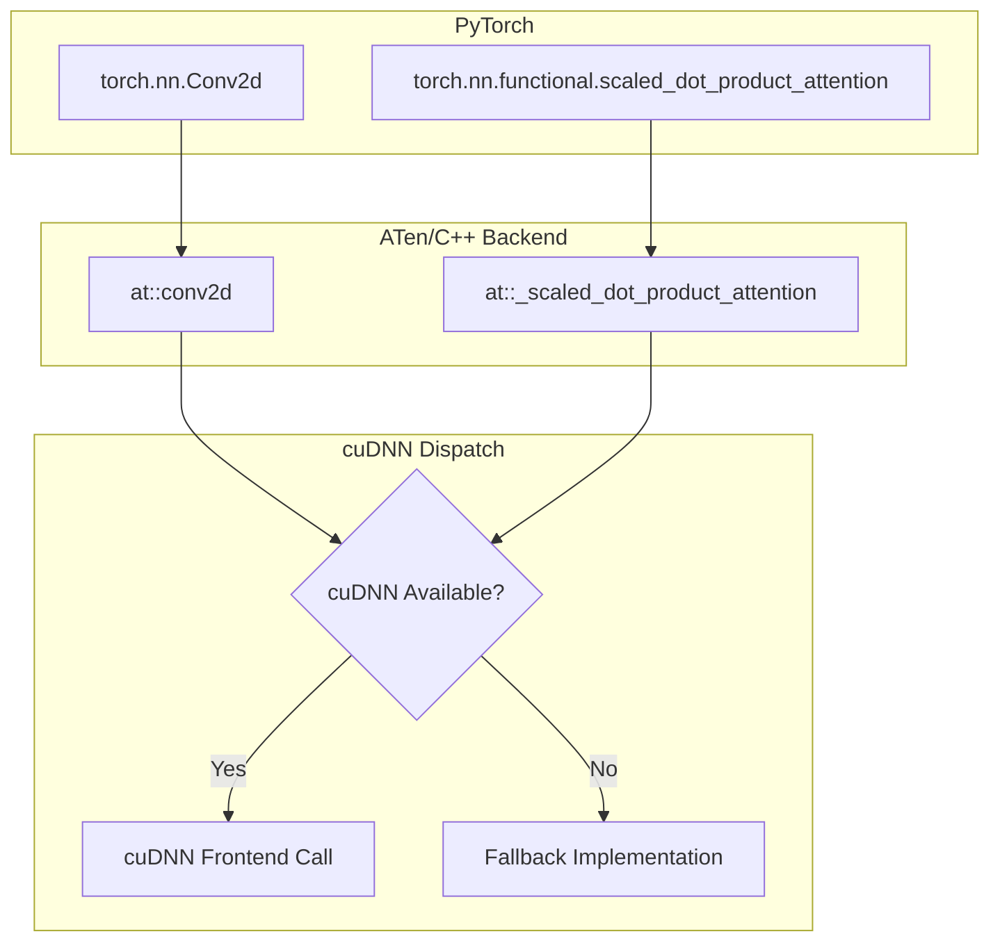
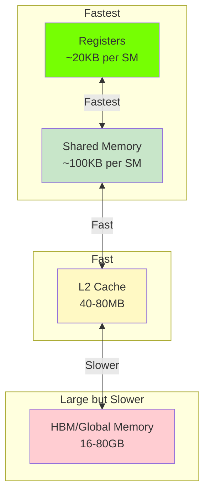
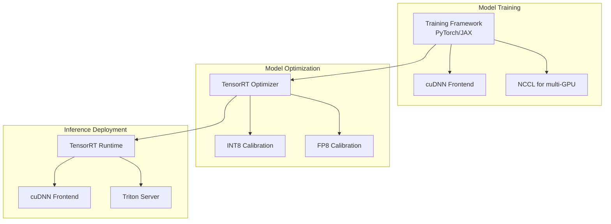

# The CUDA Ecosystem

Before diving deeper into cuDNN Frontend, let's understand where it fits in the larger NVIDIA software stack. This context will help you make better decisions and debug issues more effectively.

## The Big Picture



## NVIDIA Software Stack Components

### CUDA: The Foundation

**CUDA** (Compute Unified Device Architecture) is the foundation of GPU computing:

| Component | Purpose |
|-----------|---------|
| CUDA Toolkit | Compiler, libraries, tools |
| CUDA Runtime | API for GPU management |
| CUDA Driver | Low-level GPU communication |
| NVCC | CUDA C++ compiler |

```python
# CUDA provides basic GPU operations
import torch
x = torch.randn(1000, 1000, device="cuda")  # Allocates GPU memory via CUDA
y = x @ x  # Uses CUDA for computation
```

### cuBLAS: Basic Linear Algebra

**cuBLAS** handles fundamental linear algebra operations:

- Matrix multiplication (GEMM)
- Vector operations
- Basic transformations

!!! info "cuBLAS vs cuDNN"
    cuBLAS handles general linear algebra. cuDNN specializes in deep learning operations with additional optimizations like operation fusion.

### cuDNN: Deep Learning Primitives

**cuDNN** provides optimized implementations of deep learning operations:



**cuDNN has two parts:**

1. **cuDNN Backend**: The core C library with optimized kernels
2. **cuDNN Frontend**: The modern API layer (what we're learning!)

### cuDNN Backend vs Frontend

| Aspect | Backend (Legacy API) | Frontend (Graph API) |
|--------|---------------------|---------------------|
| Interface | C, verbose | C++/Python, elegant |
| Graph Support | Manual | Native |
| Operation Fusion | Manual | Automatic |
| Optimization | Manual tuning | Auto-tuning |
| Code Lines | Hundreds | Tens |
| Learning Curve | Steep | Gentle |

**Backend example (verbose):**

```c
// Just to set up a convolution descriptor!
cudnnConvolutionDescriptor_t convDesc;
cudnnCreateConvolutionDescriptor(&convDesc);
cudnnSetConvolution2dDescriptor(convDesc, pad_h, pad_w, stride_h, stride_w,
                                 dilation_h, dilation_w, CUDNN_CROSS_CORRELATION,
                                 CUDNN_DATA_FLOAT);
// ... many more setup calls ...
```

**Frontend equivalent (concise):**

```python
y = graph.conv_fprop(image=x, weight=w, padding=[1,1], stride=[1,1])
```

### TensorRT: Inference Optimization

**TensorRT** is NVIDIA's inference optimizer:

- Optimizes trained models for deployment
- Layer fusion, precision calibration
- Uses cuDNN internally for many operations



### NCCL: Multi-GPU Communication

**NCCL** (NVIDIA Collective Communications Library) handles:

- Multi-GPU training
- Distributed computing
- AllReduce, AllGather operations

## Framework Integration

### How PyTorch Uses cuDNN



When you write:

```python
import torch.nn.functional as F
output = F.conv2d(input, weight, padding=1)
```

PyTorch automatically:

1. Checks if cuDNN is available
2. Selects the best cuDNN algorithm
3. Executes optimized cuDNN kernels

### When to Use cuDNN Frontend Directly

| Scenario | Use Framework's cuDNN | Use cuDNN Frontend Directly |
|----------|----------------------|----------------------------|
| Standard layers | ✓ | |
| Custom fused operations | | ✓ |
| Maximum performance tuning | | ✓ |
| Framework development | | ✓ |
| Exotic architectures | | ✓ |
| Learning GPU internals | | ✓ |

## GPU Architecture Awareness

cuDNN Frontend optimizes for different GPU architectures:

| Architecture | GPUs | Key Features |
|--------------|------|--------------|
| Volta (SM70) | V100 | Tensor Cores (FP16) |
| Turing (SM75) | RTX 20xx, T4 | INT8 Tensor Cores |
| Ampere (SM80) | A100, RTX 30xx | TF32, BF16, Sparsity |
| Ada (SM89) | RTX 40xx | FP8 Transformer Engine |
| Hopper (SM90) | H100 | FP8, TMA, Async everything |
| Blackwell (SM100) | B100, RTX 50xx | Even more features |

cuDNN Frontend queries your GPU and selects optimal kernels:

```python
# cuDNN automatically detects GPU capabilities
handle = cudnn.create_handle()

# The same code runs optimally on any supported GPU
with cudnn.Graph() as graph:
    y = graph.conv_fprop(x, w)  # Uses best kernel for YOUR GPU
```

## Memory Hierarchy

Understanding GPU memory helps you write better code:



**Why cuDNN Frontend is fast:**

1. **Operation fusion** keeps data in fast registers/shared memory
2. **Minimizes HBM access** - the biggest bottleneck
3. **Optimizes for memory coalescing** - efficient memory patterns

## Typical Deep Learning Stack

For a complete AI application:



## Debugging the Stack

When things go wrong, knowing the stack helps:

### Check CUDA

```bash
nvidia-smi          # GPU status
nvcc --version      # CUDA compiler version
```

### Check cuDNN

```python
import cudnn
print(f"cuDNN Backend Version: {cudnn.backend_version()}")
# e.g., 90300 means 9.3.0
```

### Check PyTorch CUDA

```python
import torch
print(f"PyTorch CUDA: {torch.version.cuda}")
print(f"cuDNN version: {torch.backends.cudnn.version()}")
print(f"cuDNN enabled: {torch.backends.cudnn.enabled}")
```

### Enable cuDNN Logging

```bash
export CUDNN_FRONTEND_LOG_INFO=1
export CUDNN_FRONTEND_LOG_FILE=stdout
```

## Version Compatibility

Critical for avoiding issues:

| cuDNN Frontend | cuDNN Backend | CUDA | PyTorch |
|---------------|---------------|------|---------|
| 1.0.x | 8.9+ | 11.8+ | 2.0+ |
| 1.1.x | 9.0+ | 12.0+ | 2.1+ |
| 1.2.x | 9.1+ | 12.1+ | 2.2+ |

!!! warning "Version Mismatches"
    Most cuDNN errors come from version mismatches. Always verify compatibility!

## Summary

| Component | Role | Your Interaction |
|-----------|------|------------------|
| **CUDA** | GPU foundation | Usually transparent |
| **cuDNN Backend** | Optimized DL kernels | Via Frontend |
| **cuDNN Frontend** | Modern graph API | **This is what you learn!** |
| **cuBLAS** | Linear algebra | Often via frameworks |
| **TensorRT** | Inference optimization | For deployment |
| **NCCL** | Multi-GPU communication | For distributed training |

cuDNN Frontend is your **friendly interface** to the powerful cuDNN Backend, which in turn leverages CUDA to run optimized kernels on NVIDIA GPUs.

## Next Steps

Now that you understand the ecosystem, let's dive into execution plans!

[Execution Plans :material-arrow-right:](execution-plans.md){ .md-button .md-button--primary }
