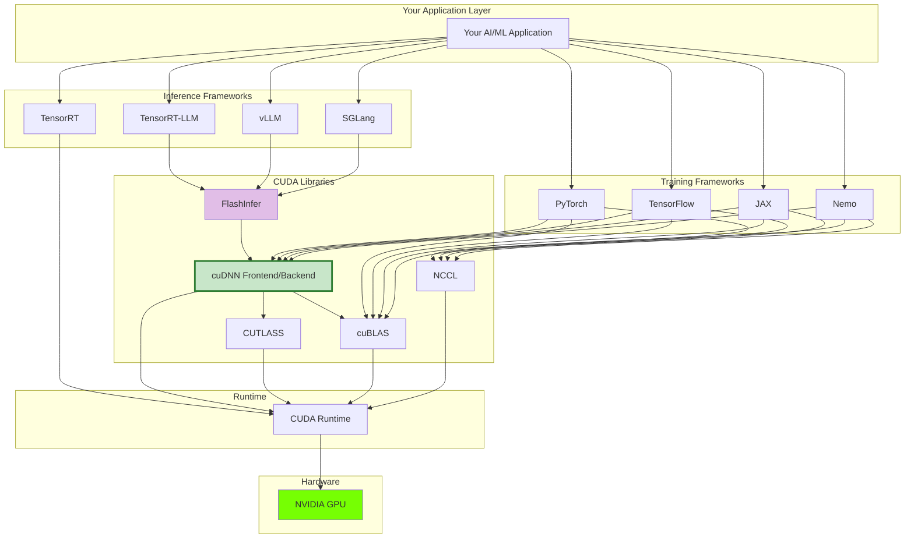

# The CUDA Ecosystem

Before diving deeper into cuDNN Frontend, let's understand where it fits in the larger NVIDIA software stack. This context will help you make better decisions and debug issues more effectively.

## The Big Picture

## Component Overview

| Component | What It Does |
|-----------|--------------|
| **Training Frameworks** | PyTorch, TensorFlow, JAX, Nemo - high-level APIs for model development |
| **Inference Frameworks** | TensorRT-LLM, vLLM, SGLang - optimized LLM serving; TensorRT - general inference |
| **FlashInfer** | Unified kernel library for LLM inference (MLSys 2025 Best Paper) |
| **cuDNN Frontend** | Modern graph-based API for deep learning ops - **what you're learning!** |
| **cuDNN Backend** | Core C library with optimized GPU kernels |
| **cuBLAS** | Basic linear algebra (GEMM, etc.) |
| **CUTLASS** | Template library for custom CUDA kernels |
| **NCCL** | Multi-GPU communication (AllReduce, etc.) |
| **CUDA Runtime** | Foundation for all GPU computing |

## Next Steps

Now that you understand where cuDNN Frontend fits, learn why it exists and what problems it solves.

[Why cuDNN Frontend? :material-arrow-right:](../getting-started/introduction.md){ .md-button .md-button--primary }
