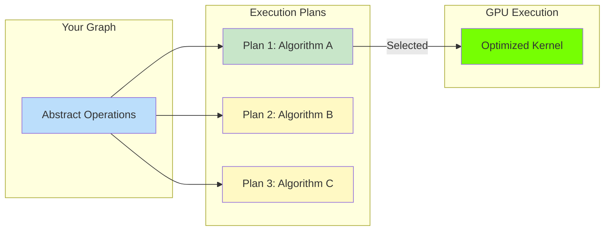
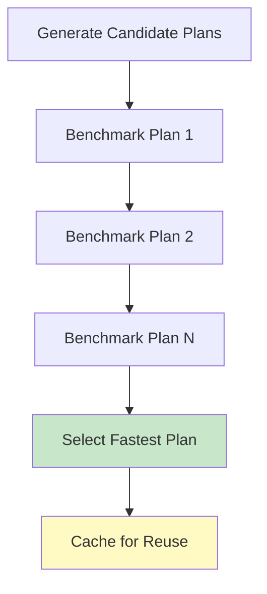
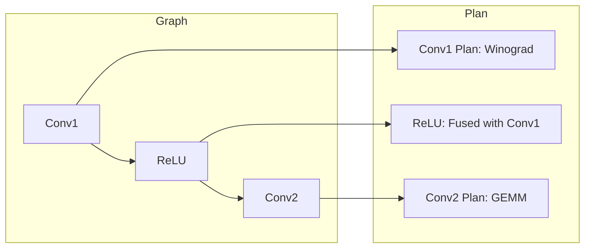
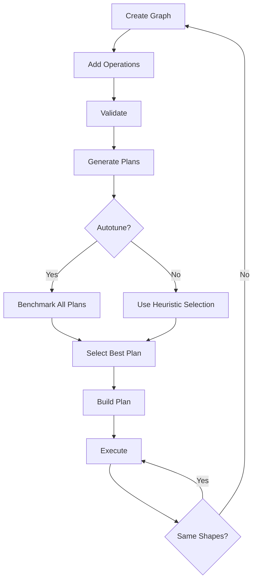

# Execution Plans

When you build a cuDNN graph, the system generates one or more **execution plans** - specific strategies for running your computation on the GPU. Understanding this process helps you optimize performance.

## What is an Execution Plan?

An execution plan is a concrete recipe for executing your graph:



## The Planning Process

When you call `graph.build()` (or exit a context manager), several steps happen:

### Step 1: Validation

The graph checks for errors:

```python
graph.validate()  # Checks shapes, types, compatibility
```

### Step 2: Lowering

Your high-level graph is converted to cuDNN's internal representation:

```python
graph.build_operation_graph()  # Creates backend operation graph
```

### Step 3: Plan Generation

cuDNN uses heuristics to generate candidate execution plans:

```python
graph.create_execution_plans([
    cudnn.heur_mode.A,        # Primary heuristic
    cudnn.heur_mode.FALLBACK  # Backup heuristic
])
```

### Step 4: Support Check

Verify plans are supported on your hardware:

```python
graph.check_support()  # Ensures at least one plan works
```

### Step 5: Plan Building

Compile the selected plan(s):

```python
graph.build_plans()  # Prepares for execution
```

## Heuristic Modes

cuDNN offers different strategies for finding execution plans:

| Mode | Description | Speed | Quality |
|------|-------------|-------|---------|
| `heur_mode.A` | Best quality heuristic | Fast | Best |
| `heur_mode.B` | Alternative heuristic | Fast | Good |
| `heur_mode.FALLBACK` | Maximum compatibility | Fast | Basic |
| `heur_mode.CUDNN_FIND` | Exhaustive search | Slow | Optimal |

```python
# Recommended: Primary + Fallback
graph.create_execution_plans([
    cudnn.heur_mode.A,
    cudnn.heur_mode.FALLBACK
])

# For maximum performance (slower initial build):
graph.create_execution_plans([
    cudnn.heur_mode.CUDNN_FIND
])
```

## Autotuning

Autotuning benchmarks multiple plans to find the fastest:

```python
# Build graph with autotuning
with cudnn.Graph() as graph:
    y = graph.conv_fprop(x, w, padding=[1, 1])
    y.set_output(True)

# Get all candidate plans
graph.build_operation_graph()
graph.create_execution_plans([cudnn.heur_mode.A])

# Autotune to find best
workspace = torch.empty(graph.get_workspace_size(), device="cuda", dtype=torch.uint8)
best_plan = graph.autotune(
    {x: x_gpu, w: w_gpu, y: y_gpu},
    workspace,
    handle=handle
)
```

### Autotuning Workflow



### When to Autotune

| Scenario | Recommendation |
|----------|----------------|
| Development/prototyping | Skip autotuning |
| Production deployment | Autotune once, cache result |
| Batch size changes frequently | Autotune each size |
| Static workload | Autotune once |

## Understanding cuDNN Algorithms

Different algorithms trade off between memory and speed:

### Convolution Algorithms

| Algorithm | Memory | Speed | Best For |
|-----------|--------|-------|----------|
| IMPLICIT_GEMM | Low | Medium | Memory-constrained |
| IMPLICIT_PRECOMP_GEMM | Medium | Fast | Most cases |
| GEMM | High | Fast | Large filters |
| FFT | Very High | Very Fast | Large images |
| WINOGRAD | Medium | Very Fast | 3x3 filters |

cuDNN Frontend selects automatically, but you can influence the choice through workspace size.

### Attention Algorithms

For SDPA, cuDNN may use:

- **Flash Attention**: Memory-efficient, fast
- **Memory Efficient Attention**: Lower memory, slightly slower
- **Standard Attention**: For small sequences

## Workspace Memory

Execution plans may need temporary memory (workspace):

```python
# Query workspace size
workspace_size = graph.get_workspace_size()
print(f"Workspace needed: {workspace_size / 1024**2:.1f} MB")

# Allocate workspace
workspace = torch.empty(workspace_size, device="cuda", dtype=torch.uint8)

# Execute with workspace
graph.execute(variant_pack, workspace, handle=handle)
```

### Workspace Strategies

| Strategy | Approach | Trade-off |
|----------|----------|-----------|
| **Minimal** | Small workspace limit | Slower algorithms |
| **Generous** | Large workspace | Faster algorithms |
| **Adaptive** | Query and allocate | Balanced |

```python
# Limit workspace to 256MB
graph.create_execution_plans(
    [cudnn.heur_mode.A],
    max_workspace_size=256 * 1024 * 1024
)
```

## Plan Serialization

Save compiled plans for faster startup:

```python
# Serialize to file
serialized = graph.serialize()
with open("conv_plan.bin", "wb") as f:
    f.write(serialized)

# Later: Deserialize
with open("conv_plan.bin", "rb") as f:
    serialized = f.read()

graph = cudnn.Graph.deserialize(serialized)
# Graph is ready to execute immediately!
```

### Serialization Benefits

- Skip compilation on subsequent runs
- Share optimized plans across machines (same GPU)
- Cache autotuned results

## Execution Plan Details

Inspect what cuDNN chose:

```python
# Build graph
with cudnn.Graph() as graph:
    y = graph.conv_fprop(x, w, padding=[1, 1])
    y.set_output(True)

# Print graph info
print(graph)  # Shows selected algorithms, workspace, etc.
```

## Multiple Execution Paths

For complex graphs, cuDNN may generate different plans for different subgraphs:



## Execution Modes

### Synchronous Execution

Default mode - waits for completion:

```python
result = graph(x, w, handle=handle)  # Blocks until done
```

### With CUDA Graphs

For repetitive execution, use CUDA graphs for minimal overhead:

```python
import cudnn

# Build cuDNN graph
with cudnn.Graph() as graph:
    y = graph.conv_fprop(x, w, padding=[1, 1])
    y.set_output(True)

# Capture into CUDA graph (advanced)
# This reduces CPU overhead for repeated execution
```

## Debugging Execution Plans

### Enable Logging

```bash
export CUDNN_FRONTEND_LOG_INFO=1
export CUDNN_FRONTEND_LOG_FILE=cudnn_log.txt
```

### Check Support Issues

```python
try:
    graph.check_support()
except Exception as e:
    print(f"No supported plan: {e}")
    # Try different parameters or check GPU compatibility
```

### Common Issues

!!! failure "No Execution Plan Found"
    **Cause**: Operation not supported on your GPU

    **Solutions**:

    - Check GPU compute capability (need SM 7.0+)
    - Verify cuDNN version compatibility
    - Try different tensor sizes/shapes
    - Use FALLBACK heuristic

!!! failure "Workspace Too Large"
    **Cause**: Best algorithm needs more memory than available

    **Solutions**:

    - Reduce batch size
    - Use workspace limit parameter
    - Accept slower algorithm

## Performance Tips

!!! tip "Execution Plan Optimization"

    1. **Autotune for production** - The time investment pays off
    2. **Cache plans** - Serialize and reuse
    3. **Right-size workspace** - More workspace = faster algorithms
    4. **Match shapes** - Consistent shapes enable plan reuse
    5. **Use channels-last** - Best algorithm availability

## Execution Plan Lifecycle Summary



## Next Steps

Learn about memory management and performance optimization.

[Memory & Performance :material-arrow-right:](memory-performance.md){ .md-button .md-button--primary }
