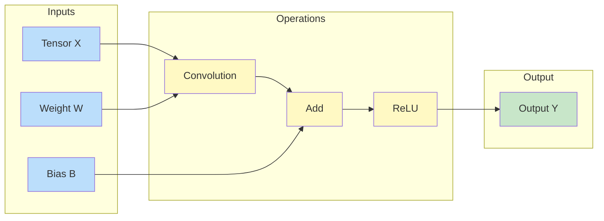
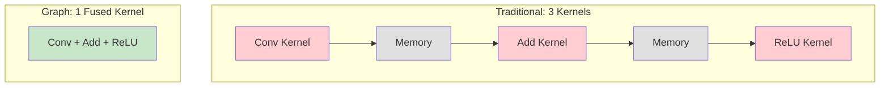
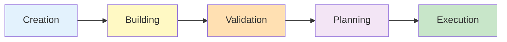
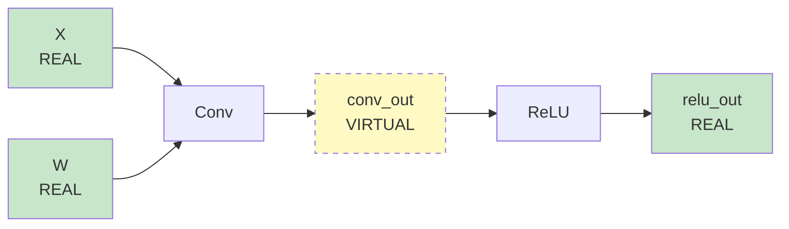

# Understanding Graphs

The **Graph API** is the heart of cuDNN Frontend. This page explains what graphs are, why they matter, and how to think about them.

## What is a Computation Graph?

A computation graph is a visual representation of mathematical operations. Instead of writing sequential code, you describe your computation as a network of connected operations.



This graph describes: **Y = ReLU(Conv(X, W) + B)**

## Why Graphs?

### Traditional Approach (Problems)

```python
# Sequential execution - each line runs independently
conv_result = convolution(x, w)       # Launch kernel 1, write to memory
bias_result = add(conv_result, bias)  # Read from memory, launch kernel 2, write
final = relu(bias_result)             # Read from memory, launch kernel 3, write
```

Problems:

- **Three separate kernel launches** - each has overhead
- **Three memory round-trips** - reading/writing intermediate results is slow
- **No cross-operation optimization** - the system can't see the big picture

### Graph Approach (Solution)

```python
# Graph-based - describe everything, then execute once
with cudnn.Graph() as graph:
    conv_result = graph.conv_fprop(x, w)
    bias_result = graph.add(conv_result, bias)
    final = graph.relu(bias_result)
    final.set_output(True)

result = graph(x, w, bias)  # Single optimized execution
```

Benefits:

- **One kernel launch** - operations are fused together
- **One memory round-trip** - intermediate results stay in registers
- **Global optimization** - cuDNN optimizes the entire graph



## Graph Lifecycle

A cuDNN graph goes through several phases:



### Phase 1: Creation

Create an empty graph with global settings:

```python
graph = cudnn.Graph(
    io_data_type=cudnn.data_type.HALF,       # Default I/O precision
    compute_data_type=cudnn.data_type.FLOAT,  # Internal computation precision
    intermediate_data_type=cudnn.data_type.FLOAT,  # Intermediate tensor precision
    name="my_graph",  # Optional name for debugging
)
```

### Phase 2: Building

Add operations (nodes) to the graph:

```python
# Each operation returns its output tensor(s)
conv_out = graph.conv_fprop(image=x, weight=w, padding=[1, 1])
relu_out = graph.relu(input=conv_out)

# Mark which tensors are outputs
relu_out.set_output(True)
```

### Phase 3: Validation

The graph checks that everything is correct:

- Tensor shapes are compatible
- Data types make sense
- Operations are supported

```python
# Validation happens automatically when using context manager
with cudnn.Graph() as graph:
    # ... build graph ...
# Validation runs here when exiting the context

# Or manually:
graph.validate()
```

### Phase 4: Planning

cuDNN finds the best way to execute your graph:

```python
# Happens automatically, or manually:
graph.build_operation_graph()
graph.create_execution_plans([cudnn.heur_mode.A, cudnn.heur_mode.FALLBACK])
graph.check_support()
graph.build_plans()
```

### Phase 5: Execution

Run the graph with actual data:

```python
result = graph(x, w, handle=handle)
```

## Graph Properties

### io_data_type

Default data type for input/output tensors:

```python
cudnn.data_type.HALF     # FP16 - fastest on modern GPUs
cudnn.data_type.FLOAT    # FP32 - full precision
cudnn.data_type.BFLOAT16 # BF16 - good range, less precision
cudnn.data_type.FP8_E4M3 # FP8 - extreme performance (Hopper+)
```

### compute_data_type

Data type for internal calculations:

```python
# Common pattern: FP16 I/O with FP32 accumulation
graph = cudnn.Graph(
    io_data_type=cudnn.data_type.HALF,
    compute_data_type=cudnn.data_type.FLOAT,  # Prevents overflow
)
```

### intermediate_data_type

For tensors between operations:

```python
# Useful for attention where softmax needs higher precision
graph = cudnn.Graph(
    io_data_type=cudnn.data_type.HALF,
    intermediate_data_type=cudnn.data_type.FLOAT,
    compute_data_type=cudnn.data_type.FLOAT,
)
```

## Graph Reuse

One of the biggest advantages of graphs is **reuse**. Build once, execute many times:

```python
# Build the graph (expensive, do once)
with cudnn.Graph() as graph:
    y = graph.conv_fprop(image=x, weight=w, padding=[1, 1])
    y.set_output(True)

# Execute many times (cheap, do often)
for batch in dataloader:
    result = graph(batch.x, batch.w, handle=handle)
```

!!! warning "Reuse Rules"
    A graph can be reused **only** if the new tensors have:

    - Same shapes as the original
    - Same data types as the original
    - Same memory layout as the original

## Virtual vs Real Tensors

When building a graph, intermediate tensors are **virtual**:

```python
with cudnn.Graph() as graph:
    conv_out = graph.conv_fprop(x, w)   # conv_out is virtual
    relu_out = graph.relu(conv_out)     # relu_out is virtual
    relu_out.set_output(True)           # Now relu_out is REAL

# Virtual tensors don't need memory allocation
# Only real (output) tensors have device memory
```



## Input/Output Specification

There are multiple ways to specify graph inputs and outputs:

### Method 1: Using Context Manager Arguments

```python
with cudnn.Graph(
    inputs=["conv::image", "conv::weight"],
    outputs=["output"],
) as graph:
    y = graph.conv_fprop(image=x, weight=w, name="conv")
    y.set_output(True).set_name("output")

# Execute with positional arguments
result = graph(x, w, handle=handle)
```

### Method 2: Using set_io_tuples

```python
with cudnn.Graph() as graph:
    y = graph.conv_fprop(image=x, weight=w, name="conv")
    y.set_output(True)

graph.set_io_tuples(["conv::image", "conv::weight"], ["conv::Y"])
result = graph(x, w, handle=handle)
```

### Method 3: Using Dictionary

```python
with cudnn.Graph() as graph:
    y = graph.conv_fprop(image=x, weight=w, name="conv")
    y.set_output(True)

# More flexible - no need to specify order
result = graph({
    "conv::image": x,
    "conv::weight": w,
}, handle=handle)
output = result["conv::Y"]
```

## Debugging Graphs

### Print Graph Info

```python
print(graph)  # Shows graph structure after building
```

### Enable Logging

```python
import os
os.environ["CUDNN_FRONTEND_LOG_INFO"] = "1"
os.environ["CUDNN_FRONTEND_LOG_FILE"] = "stdout"  # or a filename
```

### Check Support

```python
try:
    graph.check_support()
    print("Graph is supported!")
except Exception as e:
    print(f"Graph not supported: {e}")
```

## Best Practices

!!! success "Do"
    - Reuse graphs when possible
    - Use FP16/BF16 for I/O with FP32 compute
    - Mark only necessary tensors as output
    - Use meaningful names for debugging

!!! failure "Don't"
    - Rebuild graphs unnecessarily
    - Mark virtual tensors as output when not needed
    - Use mismatched tensor layouts
    - Forget to destroy handles

## Next Steps

Now that you understand graphs, learn how cuDNN selects and optimizes execution plans.

[Execution Plans :material-arrow-right:](execution-plans.md){ .md-button .md-button--primary }
