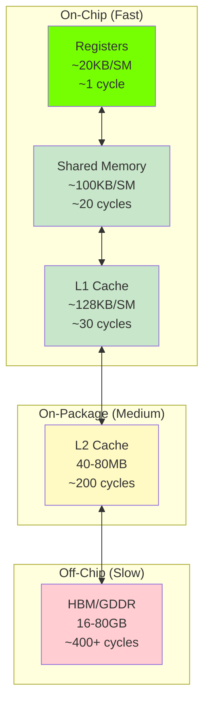

# Memory & Performance

Optimizing memory usage and performance is crucial for production deep learning. This page covers best practices for getting the most out of cuDNN Frontend.

## GPU Memory Hierarchy

Understanding GPU memory is key to optimization:



**Key insight**: Most deep learning is **memory-bound**, not compute-bound. Reducing memory traffic is often more important than reducing FLOPs.

## Why cuDNN Frontend is Fast

### 1. Operation Fusion

Without fusion:

```
Conv → Write to HBM → Read from HBM → ReLU → Write to HBM
```

With cuDNN Frontend fusion:

```
Conv → ReLU (all in registers) → Write to HBM
```

This can be **2-3x faster** for memory-bound operations!

### 2. Optimized Memory Access Patterns

cuDNN ensures:

- **Coalesced memory access**: Adjacent threads access adjacent memory
- **Optimal tiling**: Data fits in shared memory
- **Bank conflict avoidance**: Parallel shared memory access

### 3. Tensor Core Utilization

Modern GPUs have Tensor Cores - specialized hardware for matrix operations:

| Precision | Tensor Core Speed | Standard Speed |
|-----------|-------------------|----------------|
| FP16 | 312 TFLOPS (A100) | 19.5 TFLOPS |
| TF32 | 156 TFLOPS | 19.5 TFLOPS |
| FP8 | 624 TFLOPS (H100) | N/A |

cuDNN Frontend automatically uses Tensor Cores when possible.

## Memory Optimization Strategies

### Use Appropriate Data Types

```python
# FP32: Most memory, best precision
x_fp32 = torch.randn(1024, 1024, dtype=torch.float32)  # 4 MB

# FP16: Half memory, good precision
x_fp16 = torch.randn(1024, 1024, dtype=torch.float16)  # 2 MB

# FP8: Quarter memory (inference)
# Supported on Hopper and newer
```

**Memory savings by precision:**

| Precision | Relative Size | Use Case |
|-----------|--------------|----------|
| FP32 | 1.0x | Reference, debugging |
| FP16/BF16 | 0.5x | Training, inference |
| FP8 | 0.25x | Inference (Hopper+) |
| INT8 | 0.25x | Quantized inference |

### Virtual Tensors

Intermediate tensors marked as virtual don't allocate memory:

```python
with cudnn.Graph() as graph:
    # Only x, w, and final output need memory
    conv = graph.conv_fprop(x, w)      # Virtual - no allocation
    bn = graph.batchnorm(conv, ...)    # Virtual - no allocation
    relu = graph.relu(bn)              # Virtual - no allocation
    pool = graph.pooling(relu, ...)
    pool.set_output(True)              # Real - needs memory
```

### Workspace Management

cuDNN needs temporary workspace memory:

```python
# Query workspace requirement
workspace_size = graph.get_workspace_size()

# Option 1: Allocate exactly what's needed
workspace = torch.empty(workspace_size, device="cuda", dtype=torch.uint8)

# Option 2: Pre-allocate generous workspace for all graphs
MAX_WORKSPACE = 1024 * 1024 * 1024  # 1 GB
global_workspace = torch.empty(MAX_WORKSPACE, device="cuda", dtype=torch.uint8)
```

### Memory-Efficient Attention

For transformers, use SDPA which implements flash attention:

```python
# Standard attention: O(N²) memory
# scores = Q @ K.T  # [B, H, N, N] - huge for large N!

# cuDNN SDPA: O(N) memory
o, _ = graph.sdpa(q, k, v, attn_scale=scale)
# Never materializes full attention matrix!
```

## Performance Optimization

### 1. Batch Size Tuning

Larger batches = better GPU utilization:

| Batch Size | GPU Utilization | Memory | Training Speed |
|------------|-----------------|--------|----------------|
| 1 | 10-20% | Low | Slow |
| 32 | 60-80% | Medium | Good |
| 128 | 90%+ | High | Best |
| 512+ | ~100% | Very High | Optimal |

```python
# Find optimal batch size
for batch_size in [32, 64, 128, 256]:
    try:
        x = torch.randn(batch_size, 64, 224, 224, device="cuda")
        # ... test training loop ...
    except RuntimeError as e:  # Out of memory
        print(f"Max batch size: {batch_size // 2}")
        break
```

### 2. Graph Reuse

Building graphs is expensive. Always reuse:

```python
# BAD: Rebuilding every iteration
for batch in dataloader:
    with cudnn.Graph() as graph:  # Slow!
        y = graph.conv_fprop(batch.x, w)
        y.set_output(True)
    result = graph(batch.x, w, handle=handle)

# GOOD: Build once, reuse
with cudnn.Graph() as graph:
    y = graph.conv_fprop(template_x, w)
    y.set_output(True)

for batch in dataloader:
    result = graph(batch.x, w, handle=handle)  # Fast!
```

### 3. Autotuning

Invest time upfront for faster execution:

```python
# Autotune once at startup
best_plan = graph.autotune(variant_pack, workspace, handle=handle)

# Save for future runs
with open("tuned_plan.bin", "wb") as f:
    f.write(graph.serialize())
```

### 4. Mixed Precision

Use lower precision where possible:

```python
# Optimal mixed precision setup
graph = cudnn.Graph(
    io_data_type=cudnn.data_type.HALF,       # FP16 I/O
    intermediate_data_type=cudnn.data_type.FLOAT,  # FP32 softmax
    compute_data_type=cudnn.data_type.FLOAT,  # FP32 accumulation
)
```

### 5. Memory Layout

Channels-last (NHWC) is faster on modern GPUs:

```python
# BAD: Channels-first (NCHW)
x = torch.randn(8, 64, 224, 224, device="cuda")

# GOOD: Channels-last (NHWC)
x = torch.randn(8, 64, 224, 224, device="cuda").to(
    memory_format=torch.channels_last
)
```

## Profiling

### cuDNN Logging

```bash
# Enable detailed logging
export CUDNN_FRONTEND_LOG_INFO=1
export CUDNN_FRONTEND_LOG_FILE=cudnn_perf.log
```

### NVIDIA Nsight Systems

Profile the full stack:

```bash
nsys profile -o report python train.py
```

### PyTorch Profiler

```python
with torch.profiler.profile(
    activities=[
        torch.profiler.ProfilerActivity.CPU,
        torch.profiler.ProfilerActivity.CUDA,
    ],
    with_stack=True,
) as prof:
    result = graph(x, w, handle=handle)

print(prof.key_averages().table(sort_by="cuda_time_total"))
```

## Memory Debugging

### Check Memory Usage

```python
# Current allocation
print(f"Allocated: {torch.cuda.memory_allocated() / 1e9:.2f} GB")

# Peak allocation
print(f"Peak: {torch.cuda.max_memory_allocated() / 1e9:.2f} GB")

# Reserved by allocator
print(f"Reserved: {torch.cuda.memory_reserved() / 1e9:.2f} GB")
```

### Find Memory Leaks

```python
torch.cuda.reset_peak_memory_stats()

# Your code here
result = graph(x, w, handle=handle)

print(f"Memory used: {torch.cuda.max_memory_allocated() / 1e9:.2f} GB")
```

### Memory Snapshot

```python
# For detailed memory analysis
torch.cuda.memory._record_memory_history()

# ... your operations ...

torch.cuda.memory._dump_snapshot("memory_snapshot.pickle")
```

## Performance Checklist

!!! success "Before Production Deployment"

    - [ ] Use FP16/BF16 where accuracy permits
    - [ ] Enable channels-last memory format
    - [ ] Autotune execution plans
    - [ ] Cache/serialize optimized plans
    - [ ] Reuse graphs (don't rebuild)
    - [ ] Profile with Nsight Systems
    - [ ] Test with production batch sizes
    - [ ] Verify memory usage fits target GPU

## Common Performance Issues

!!! failure "Slow First Iteration"
    **Cause**: JIT compilation, graph building

    **Solution**: Warm up with a dummy batch before timing

!!! failure "High Memory Usage"
    **Cause**: Large intermediate tensors, inefficient algorithm

    **Solutions**:

    - Use virtual tensors where possible
    - Limit workspace size
    - Reduce batch size
    - Use gradient checkpointing

!!! failure "Low GPU Utilization"
    **Cause**: Small batch size, CPU bottleneck, memory transfers

    **Solutions**:

    - Increase batch size
    - Use data prefetching
    - Profile to find bottleneck
    - Ensure data is already on GPU

## Architecture-Specific Tips

### Ampere (A100, RTX 30xx)

- Use TF32 for faster FP32-like training
- BF16 well-supported
- Large L2 cache (40MB)

### Hopper (H100)

- Use FP8 for maximum throughput
- Transformer Engine integration
- TMA (Tensor Memory Accelerator)

### Ada (RTX 40xx)

- Good FP8 support
- Efficient for inference
- Strong for mixed workloads

## Summary

| Optimization | Impact | Effort |
|--------------|--------|--------|
| Graph reuse | High | Low |
| Channels-last | High | Low |
| Mixed precision | High | Medium |
| Autotuning | Medium | Low |
| Virtual tensors | Medium | Low |
| Workspace tuning | Low | Low |

## Next Steps

Put these concepts into practice with hands-on tutorials!

[Convolution Tutorial :material-arrow-right:](../tutorials/convolution.md){ .md-button .md-button--primary }
