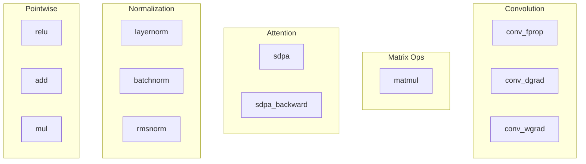
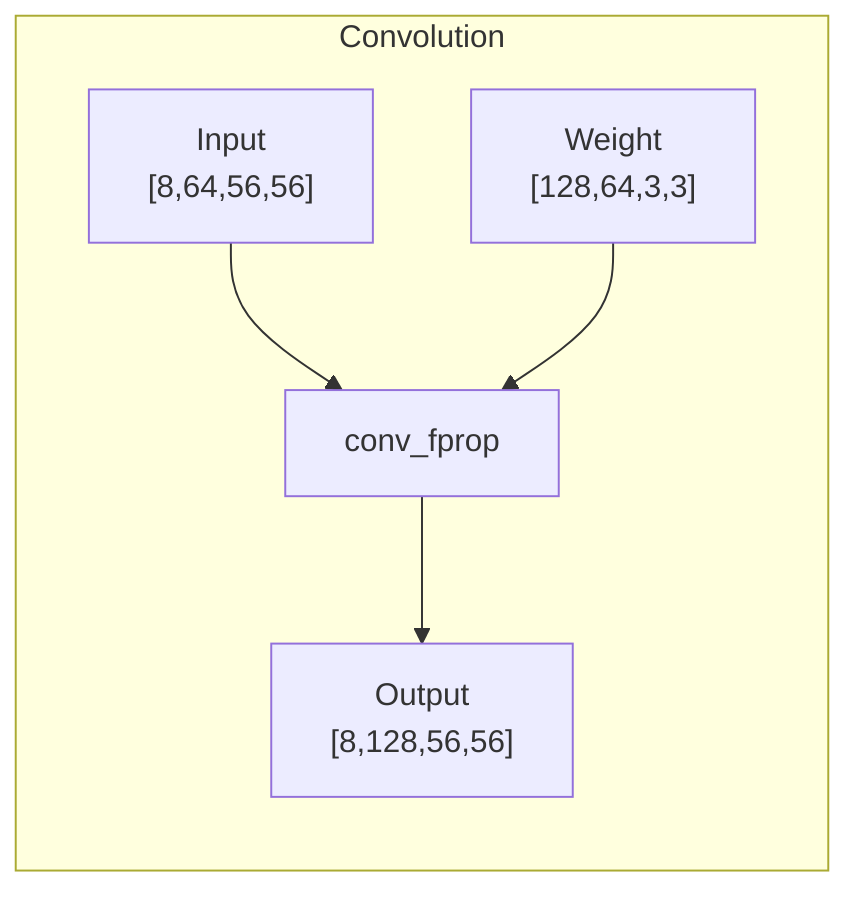

# Operations

Operations are the building blocks of your computation graphs. This page covers the main operation types in cuDNN Frontend.

## Operation Categories

cuDNN Frontend supports these main categories:



## Convolution Operations

### Forward Convolution (conv_fprop)

The workhorse of computer vision - slides filters over images:

```python
y = graph.conv_fprop(
    image=x,           # Input tensor [N, C, H, W]
    weight=w,          # Filter tensor [K, C, R, S]
    padding=[1, 1],    # Padding [pad_h, pad_w]
    stride=[1, 1],     # Stride [stride_h, stride_w]
    dilation=[1, 1],   # Dilation [dilation_h, dilation_w]
    compute_data_type=cudnn.data_type.FLOAT,
    name="conv"
)
```

**Parameters explained:**

| Parameter | Description | Typical Values |
|-----------|-------------|----------------|
| padding | Zero-padding added to input | [1,1] for 3x3 kernel |
| stride | Step size of the filter | [1,1] or [2,2] |
| dilation | Spacing between filter elements | [1,1] (no dilation) |



### Data Gradient (conv_dgrad)

Backpropagation through convolution - computes gradient w.r.t input:

```python
dx = graph.conv_dgrad(
    weight=w,          # Same weights used in forward
    loss=dy,           # Gradient from next layer
    padding=[1, 1],
    stride=[1, 1],
    dilation=[1, 1],
)
```

### Weight Gradient (conv_wgrad)

Computes gradient w.r.t weights for training:

```python
dw = graph.conv_wgrad(
    image=x,           # Original input
    loss=dy,           # Gradient from next layer
    padding=[1, 1],
    stride=[1, 1],
    dilation=[1, 1],
)
```

## Matrix Multiplication

### Basic Matmul

General matrix multiplication: `C = A @ B`

```python
C = graph.matmul(
    A=A,               # [M, K] or [B, M, K]
    B=B,               # [K, N] or [B, K, N]
    compute_data_type=cudnn.data_type.FLOAT,
    name="gemm"
)
```

**Batch matmul is supported:**

```python
# Batched: [32, 512, 256] @ [32, 256, 1024] = [32, 512, 1024]
A = torch.randn(32, 512, 256, device="cuda", dtype=torch.float16)
B = torch.randn(32, 256, 1024, device="cuda", dtype=torch.float16)

C = graph.matmul(A=A, B=B)
```

## Attention Operations

### Scaled Dot-Product Attention (SDPA)

The core of transformer models:

$$\text{Attention}(Q, K, V) = \text{softmax}\left(\frac{QK^\top}{\sqrt{d_k}}\right)V$$

```python
import math

# Q, K, V: [batch, num_heads, seq_len, head_dim]
o, stats = graph.sdpa(
    q=Q,
    k=K,
    v=V,
    attn_scale=1.0 / math.sqrt(head_dim),
    is_inference=True,         # False for training
    use_causal_mask=True,      # Autoregressive mask
    name="attention"
)
```

**Key parameters:**

| Parameter | Description |
|-----------|-------------|
| attn_scale | Scaling factor (usually 1/sqrt(d_k)) |
| is_inference | True for inference, False for training |
| use_causal_mask | Triangular mask for autoregressive |
| generate_stats | Return stats for backward pass |

**For training (backward pass):**

```python
# Forward with stats
o, stats = graph.sdpa(
    q=Q, k=K, v=V,
    attn_scale=attn_scale,
    is_inference=False,
    generate_stats=True,
)

# Backward
dQ, dK, dV = graph.sdpa_backward(
    q=Q, k=K, v=V, o=o,
    dO=grad_output,
    stats=stats,
    attn_scale=attn_scale,
)
```

## Normalization Operations

### Layer Normalization

Normalizes across feature dimension:

```python
# Input: [batch, seq_len, hidden_dim]
y, mean, inv_var = graph.layernorm(
    input=x,
    scale=gamma,       # [hidden_dim]
    bias=beta,         # [hidden_dim]
    epsilon=1e-5,
    name="layernorm"
)
```

### RMS Normalization

Root Mean Square normalization (used in LLaMA, etc.):

```python
y, inv_rms = graph.rmsnorm(
    input=x,
    scale=gamma,
    epsilon=1e-5,
)
```

### Batch Normalization

Normalizes across batch dimension:

```python
# Training
y, running_mean, running_var, saved_mean, saved_inv_var = graph.batchnorm(
    input=x,
    scale=gamma,
    bias=beta,
    running_mean=running_mean,
    running_var=running_var,
    epsilon=1e-5,
    momentum=0.1,
)

# Inference
y = graph.batchnorm_inference(
    input=x,
    scale=gamma,
    bias=beta,
    mean=running_mean,
    inv_variance=1.0 / torch.sqrt(running_var + 1e-5),
)
```

## Pointwise Operations

Pointwise operations apply element-by-element transformations:

### Activation Functions

```python
# ReLU: max(0, x)
y = graph.relu(input=x)

# GELU: x * Φ(x)
y = graph.gelu(input=x)

# SiLU/Swish: x * sigmoid(x)
y = graph.silu(input=x)

# Tanh
y = graph.tanh(input=x)

# Sigmoid
y = graph.sigmoid(input=x)
```

### Arithmetic Operations

```python
# Addition
y = graph.add(a=x, b=z)

# Multiplication
y = graph.mul(a=x, b=z)

# Bias addition
y = graph.bias(input=x, bias=b)

# Scale
y = graph.scale(input=x, scale=s)
```

### Custom Pointwise

For operations not directly exposed:

```python
# Using pointwise descriptor
pw_desc = cudnn.create_pointwise_descriptor(
    mode=cudnn.pointwise_mode.EXP
)
y = graph.pointwise(
    input=x,
    descriptor=pw_desc,
)
```

## Operation Fusion

One of cuDNN Frontend's superpowers is **operation fusion** - combining multiple operations into one kernel:

```python
with cudnn.Graph() as graph:
    # These will be fused into a single kernel!
    conv_out = graph.conv_fprop(x, w, padding=[1,1])
    bias_out = graph.bias(conv_out, b)
    bn_out = graph.batchnorm(bias_out, ...)
    relu_out = graph.relu(bn_out)
    relu_out.set_output(True)
```

### Fusion Patterns

Common patterns that fuse well:

| Pattern | Example |
|---------|---------|
| Conv + Bias + Activation | `conv -> bias -> relu` |
| Matmul + Bias + Activation | `matmul -> bias -> gelu` |
| Norm + Pointwise | `layernorm -> dropout` |
| SDPA (all internal ops) | Q@K, softmax, dropout, @V |

### Virtual Tensors Enable Fusion

```python
# Only relu_out needs memory - others stay in registers
conv_out = graph.conv_fprop(x, w)   # Virtual
bias_out = graph.bias(conv_out, b)  # Virtual
relu_out = graph.relu(bias_out)     # Real (set_output)
relu_out.set_output(True)
```

## Output Tensor Configuration

After an operation, configure the output:

```python
y = graph.conv_fprop(x, w)

# Mark as output (required to retrieve)
y.set_output(True)

# Optional: give it a name
y.set_name("conv_output")

# Optional: force data type
y.set_data_type(cudnn.data_type.FLOAT)

# Optional: set explicit dimensions
y.set_dim([8, 128, 56, 56])
y.set_stride([128*56*56, 1, 128*56, 128])
```

## Operation Naming

Naming helps with debugging and I/O specification:

```python
y = graph.conv_fprop(x, w, name="encoder_conv1")

# Reference inputs/outputs by name:
# - "encoder_conv1::image"  (input)
# - "encoder_conv1::weight" (input)
# - "encoder_conv1::Y"      (output)
```

## Next Steps

Learn how cuDNN selects and optimizes execution plans.

[Execution Plans :material-arrow-right:](execution-plans.md){ .md-button .md-button--primary }
