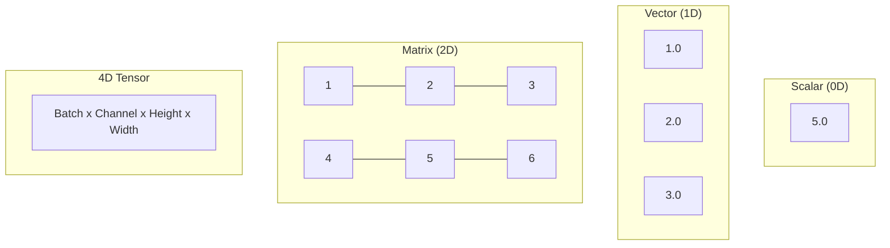
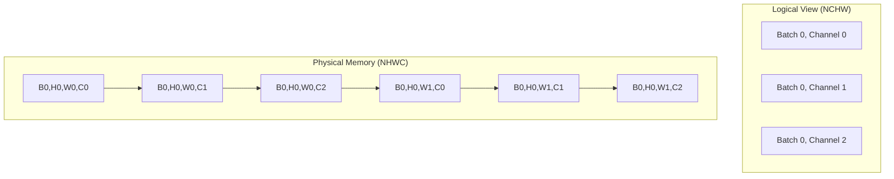

# Tensors Explained

Tensors are the fundamental data structures in deep learning. This page explains how cuDNN Frontend handles tensors and the critical details you need to know.

## What is a Tensor?

A tensor is a multi-dimensional array of numbers. In deep learning:

| Dimensions | Name | Example Use |
|------------|------|-------------|
| 0D | Scalar | Loss value |
| 1D | Vector | Bias, batch norm stats |
| 2D | Matrix | Fully connected weights |
| 3D | 3D Tensor | Sequences (batch, seq, features) |
| 4D | 4D Tensor | Images (batch, channels, height, width) |
| 5D+ | Higher | Video, 3D convolutions |



## Tensor Properties in cuDNN

Every cuDNN tensor has these key properties:

### Dimensions (Shape)

The size of each dimension:

```python
# Image tensor: batch=8, channels=64, height=56, width=56
dims = [8, 64, 56, 56]
```

### Strides

How many elements to skip to move one position in each dimension:

```python
# For contiguous NCHW tensor [8, 64, 56, 56]:
# To move +1 in batch (N): skip 64*56*56 = 200704 elements
# To move +1 in channel (C): skip 56*56 = 3136 elements
# To move +1 in height (H): skip 56 elements
# To move +1 in width (W): skip 1 element
strides = [200704, 3136, 56, 1]  # NCHW layout
```

### Data Type

The numeric precision:

```python
cudnn.data_type.HALF      # 16-bit floating point
cudnn.data_type.FLOAT     # 32-bit floating point
cudnn.data_type.BFLOAT16  # Brain floating point 16
cudnn.data_type.FP8_E4M3  # 8-bit (Hopper GPUs)
cudnn.data_type.INT8      # 8-bit integer
```

## Memory Layouts: The Critical Concept

!!! warning "This is Important!"
    Memory layout is the #1 source of errors for cuDNN beginners. Understanding it is essential.

### Logical vs Physical Layout

A tensor has two layouts:

- **Logical layout**: How you think about the data (e.g., [batch, channel, height, width])
- **Physical layout**: How the data is actually stored in memory



### NCHW vs NHWC

For 4D image tensors:

| Layout | Order | Memory Pattern | GPU Performance |
|--------|-------|----------------|-----------------|
| NCHW | Batch, Channel, Height, Width | All red pixels, then all green, then blue | Slower |
| NHWC | Batch, Height, Width, Channel | RGB together for each pixel | Faster |

```
NCHW (channels first):
[R00, R01, R10, R11, G00, G01, G10, G11, B00, B01, B10, B11]

NHWC (channels last):
[R00, G00, B00, R01, G01, B01, R10, G10, B10, R11, G11, B11]
```

!!! tip "Use Channels-Last"
    Modern NVIDIA GPUs are optimized for **NHWC (channels-last)** layout. Always use it for convolutions!

### Creating Channels-Last Tensors in PyTorch

```python
# Method 1: Create and convert
x = torch.randn(8, 64, 56, 56, device="cuda", dtype=torch.float16)
x = x.to(memory_format=torch.channels_last)

# Method 2: Create with permute
x = torch.randn(8, 56, 56, 64, device="cuda", dtype=torch.float16)  # NHWC shape
x = x.permute(0, 3, 1, 2)  # Logical NCHW, physical NHWC

# Check layout
print(x.is_contiguous())  # False (not NCHW contiguous)
print(x.is_contiguous(memory_format=torch.channels_last))  # True
```

## Creating Tensors in cuDNN

### From PyTorch Tensors

The simplest way - cuDNN infers properties from PyTorch:

```python
x_torch = torch.randn(8, 64, 56, 56, device="cuda", dtype=torch.float16)

with cudnn.Graph() as graph:
    # cuDNN extracts shape, stride, dtype from x_torch
    y = graph.conv_fprop(image=x_torch, weight=w_torch)
```

### Explicit Tensor Creation

For more control:

```python
graph = cudnn.pygraph()

# Create tensor with explicit properties
x = graph.tensor(
    name="X",
    dim=[8, 64, 56, 56],
    stride=[56*56*64, 1, 56*64, 64],  # NHWC strides
    data_type=cudnn.data_type.HALF,
)
```

### Using tensor_like

Create a cuDNN tensor matching a PyTorch tensor:

```python
x_torch = torch.randn(8, 64, 56, 56, device="cuda")

graph = cudnn.pygraph()
x = graph.tensor_like(x_torch)  # Copies all properties
```

## Special Tensor Properties

### Virtual Tensors

Intermediate results that don't need memory:

```python
with cudnn.Graph() as graph:
    # conv_out is virtual - no memory allocated
    conv_out = graph.conv_fprop(x, w)

    # relu_out is real - memory will be allocated
    relu_out = graph.relu(conv_out)
    relu_out.set_output(True)  # Makes it real
```

### Pass-by-Value Tensors

For scalar values (like scaling factors):

```python
# Scalar passed directly
scale = graph.tensor(
    dim=[1],
    stride=[1],
    is_pass_by_value=True,  # Value passed directly, not via pointer
)
```

### Ragged Tensors

For variable-length sequences:

```python
# Tensor with ragged dimension
# Useful for batched sequences of different lengths
ragged_dim = graph.tensor(
    dim=[batch_size, max_seq_len],
    stride=[max_seq_len, 1],
    ragged_offset=offsets_tensor,  # Where each sequence ends
)
```

## Tensor Operations

### set_output

Mark tensor as graph output:

```python
y = graph.conv_fprop(x, w)
y.set_output(True)  # Required to retrieve this tensor
```

### set_name

Give tensor a name for reference:

```python
y.set_name("conv_output")

# Later reference as "conv_output" or via node::name
```

### set_data_type

Override data type:

```python
y.set_data_type(cudnn.data_type.FLOAT)  # Force FP32 output
```

### set_dim / set_stride

Manually specify shape and layout:

```python
y.set_dim([8, 32, 56, 56])
y.set_stride([32*56*56, 1, 32*56, 32])  # NHWC
```

## Computing Strides

Here's how to compute strides for common layouts:

### NCHW (Channels First)

```python
def nchw_strides(N, C, H, W):
    return [C * H * W, H * W, W, 1]

# Example: [8, 64, 56, 56]
# Strides: [200704, 3136, 56, 1]
```

### NHWC (Channels Last)

```python
def nhwc_strides(N, C, H, W):
    return [H * W * C, 1, W * C, C]

# Example: [8, 64, 56, 56]
# Strides: [200704, 1, 3584, 64]
```

### PyTorch Helper

```python
import torch

# Create tensor and check strides
x = torch.randn(8, 64, 56, 56).to(memory_format=torch.channels_last)
print(f"Strides: {x.stride()}")  # (200704, 1, 3584, 64)
```

## Common Mistakes

!!! failure "Wrong Strides"
    ```python
    # WRONG: Using NCHW strides for NHWC tensor
    x = graph.tensor(
        dim=[8, 64, 56, 56],
        stride=[200704, 3136, 56, 1],  # NCHW strides!
    )
    ```

    ```python
    # CORRECT: Use NHWC strides
    x = graph.tensor(
        dim=[8, 64, 56, 56],
        stride=[200704, 1, 3584, 64],  # NHWC strides
    )
    ```

!!! failure "Forgetting set_output"
    ```python
    # WRONG: Can't retrieve y
    y = graph.conv_fprop(x, w)
    # y is virtual, no memory!

    # CORRECT
    y = graph.conv_fprop(x, w)
    y.set_output(True)  # Now y is real
    ```

!!! failure "Mismatched Layouts"
    ```python
    # WRONG: PyTorch NCHW, but cuDNN expects NHWC
    x = torch.randn(8, 64, 56, 56, device="cuda")  # Contiguous NCHW

    # CORRECT: Convert to channels-last
    x = torch.randn(8, 64, 56, 56, device="cuda").to(
        memory_format=torch.channels_last
    )
    ```

## Data Type Considerations

### Precision vs Performance

| Type | Bits | Precision | Speed | Use Case |
|------|------|-----------|-------|----------|
| FP32 | 32 | High | Baseline | Training accuracy-critical |
| FP16 | 16 | Medium | 2x faster | Most training/inference |
| BF16 | 16 | Medium | 2x faster | Transformers |
| FP8 | 8 | Low | 4x faster | Inference (Hopper+) |

### Mixed Precision

Use lower precision I/O with higher precision compute:

```python
with cudnn.Graph(
    io_data_type=cudnn.data_type.HALF,       # Fast FP16 I/O
    compute_data_type=cudnn.data_type.FLOAT,  # Accurate FP32 math
) as graph:
    y = graph.conv_fprop(x, w)
```

## Next Steps

Now let's explore the operations you can perform on tensors.

[Operations Guide :material-arrow-right:](operations.md){ .md-button .md-button--primary }
