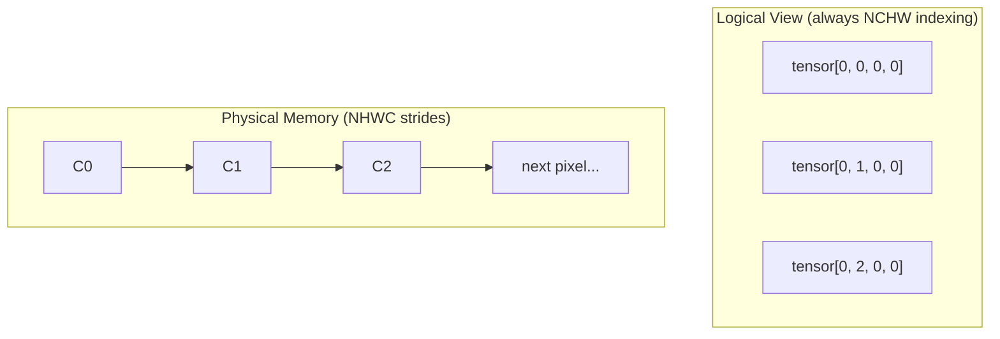

# Tensors Explained

Tensors are the fundamental data structures in deep learning. This page explains how cuDNN Frontend handles tensors and the critical details you need to know.

## What is a Tensor?

A tensor is a multi-dimensional array of numbers. Unlike general-purpose frameworks, **cuDNN operations expect specific tensor dimensions**:

| Operation | Required Dims | Shape | Notes |
|-----------|---------------|-------|-------|
| **MatMul** | 3D | `[B, M, K] × [B, K, N]` | Use `B=1` for non-batched |
| **Attention (SDPA)** | 4D | `[B, H, S, D]` | Batch, Heads, SeqLen, HeadDim |
| **Conv 2D** | 4D | `[N, C, H, W]` | Batch, Channels, Height, Width |
| **Conv 3D** | 5D | `[N, C, D, H, W]` | Adds Depth dimension |
| **Normalization** | 4D+ | `[N, C, ...]` | Varies by norm type |

!!! warning "Dimension Requirements"
    cuDNN does **not** support arbitrary tensor dimensions. Each operation interprets tensors in a specific way. A 2D matrix `[M, N]` must be reshaped to `[1, M, N]` for matmul.

## Tensor Properties in cuDNN

Every cuDNN tensor has these key properties:

### Dimensions (Shape)

The size of each dimension:

```python
# Image tensor: batch=8, channels=64, height=56, width=56
dims = [8, 64, 56, 56]
```

### Strides

How many elements to skip to move one position in each dimension:

```python
# For contiguous NCHW tensor [8, 64, 56, 56]:
# To move +1 in batch (N): skip 64*56*56 = 200704 elements
# To move +1 in channel (C): skip 56*56 = 3136 elements
# To move +1 in height (H): skip 56 elements
# To move +1 in width (W): skip 1 element
strides = [200704, 3136, 56, 1]  # NCHW layout
```

### Data Type

The numeric precision:

```python
cudnn.data_type.HALF      # 16-bit floating point
cudnn.data_type.FLOAT     # 32-bit floating point
cudnn.data_type.BFLOAT16  # Brain floating point 16
cudnn.data_type.FP8_E4M3  # 8-bit (Hopper GPUs)
cudnn.data_type.INT8      # 8-bit integer
```

## cuDNN Tensors Are Descriptors, Not Memory

!!! warning "Key Difference from PyTorch"
    A **cuDNN tensor** is just a **descriptor** - it describes the shape, strides, and data type of a tensor, but **does not allocate any memory**.

    A **PyTorch tensor** allocates and owns the underlying memory buffer.

```python
# PyTorch: Allocates memory
x_torch = torch.randn(8, 64, 56, 56, device="cuda")  # Memory allocated!

# cuDNN: Just a descriptor - NO memory allocated
x_cudnn = graph.tensor(
    dim=[8, 64, 56, 56],
    stride=[200704, 1, 3584, 64],
    data_type=cudnn.data_type.HALF,
)
# x_cudnn only describes layout - you must provide memory later
```

**Why this matters:**

1. You allocate memory yourself (typically via PyTorch)
2. You pass memory pointers to cuDNN at execution time
3. cuDNN reads from / writes to your memory

```python
# Workflow:
# 1. Create descriptor
x = graph.tensor(dim=[8, 64], stride=[64, 1], data_type=cudnn.data_type.HALF)

# 2. Build graph
y = graph.matmul(x, w)
y.set_output(True)
graph.build()

# 3. Allocate REAL memory (PyTorch)
x_data = torch.randn(8, 64, device="cuda", dtype=torch.float16)
y_data = torch.empty(8, 32, device="cuda", dtype=torch.float16)

# 4. Execute with memory pointers
graph.execute({x: x_data, y: y_data}, workspace, handle=handle)
```

This separation allows cuDNN to:

- Plan execution before knowing actual data
- Reuse the same graph with different memory buffers
- Optimize memory layout without copying data

## Memory Layouts: The Critical Concept

!!! warning "This is Important!"
    Memory layout is the #1 source of errors for cuDNN beginners. Understanding it is essential.

### Logical vs Physical Layout

A tensor has two layouts that can be **different**:

- **Logical layout**: How you index the data (e.g., `tensor[batch, channel, height, width]`)
- **Physical layout**: How bytes are actually arranged in GPU memory

**Strides determine the physical layout.** Two tensors with the same logical shape can have completely different memory layouts:

```python
# Same logical shape [2, 3, 4, 4], different physical layouts

# NCHW layout - channels are contiguous
nchw_strides = [48, 16, 4, 1]  # stride[C]=16 means channels grouped together

# NHWC layout - pixels are contiguous
nhwc_strides = [48, 1, 12, 3]  # stride[C]=1 means channels interleaved
```



!!! tip "Key Insight"
    The **logical dimension order** (NCHW) stays the same for indexing. The **strides** control how that maps to physical memory. This is why you can have a "channels-last" tensor that you still index as `[N, C, H, W]`.

### NCHW vs NHWC

For 4D image tensors:

| Layout | Order | Memory Pattern | GPU Performance |
|--------|-------|----------------|-----------------|
| NCHW | Batch, Channel, Height, Width | All red pixels, then all green, then blue | Slower |
| NHWC | Batch, Height, Width, Channel | RGB together for each pixel | Faster |

```
NCHW (channels first):
[R00, R01, R10, R11, G00, G01, G10, G11, B00, B01, B10, B11]

NHWC (channels last):
[R00, G00, B00, R01, G01, B01, R10, G10, B10, R11, G11, B11]
```

!!! tip "Use Channels-Last"
    Modern NVIDIA GPUs are optimized for **NHWC (channels-last)** layout. Always use it for convolutions!

### Creating Channels-Last Tensors in PyTorch

```python
# Method 1: Create and convert
x = torch.randn(8, 64, 56, 56, device="cuda", dtype=torch.float16)
x = x.to(memory_format=torch.channels_last)

# Method 2: Create with permute
x = torch.randn(8, 56, 56, 64, device="cuda", dtype=torch.float16)  # NHWC shape
x = x.permute(0, 3, 1, 2)  # Logical NCHW, physical NHWC

# Check layout
print(x.is_contiguous())  # False (not NCHW contiguous)
print(x.is_contiguous(memory_format=torch.channels_last))  # True
```

## Creating Tensors in cuDNN

### From PyTorch Tensors

The simplest way - cuDNN infers properties from PyTorch:

```python
x_torch = torch.randn(8, 64, 56, 56, device="cuda", dtype=torch.float16)

with cudnn.Graph() as graph:
    # cuDNN extracts shape, stride, dtype from x_torch
    y = graph.conv_fprop(image=x_torch, weight=w_torch)
```

### Explicit Tensor Creation

For more control:

```python
graph = cudnn.pygraph()

# Create tensor with explicit properties
x = graph.tensor(
    name="X",
    dim=[8, 64, 56, 56],
    stride=[56*56*64, 1, 56*64, 64],  # NHWC strides
    data_type=cudnn.data_type.HALF,
)
```

### Using tensor_like

Create a cuDNN tensor matching a PyTorch tensor:

```python
x_torch = torch.randn(8, 64, 56, 56, device="cuda")

graph = cudnn.pygraph()
x = graph.tensor_like(x_torch)  # Copies all properties
```

## Special Tensor Properties

### Virtual Tensors

Intermediate results that don't need memory:

```python
with cudnn.Graph() as graph:
    # conv_out is virtual - no memory allocated
    conv_out = graph.conv_fprop(x, w)

    # relu_out is real - memory will be allocated
    relu_out = graph.relu(conv_out)
    relu_out.set_output(True)  # Makes it real
```

### Pass-by-Value Tensors

For scalar values (like scaling factors):

```python
# Scalar passed directly
scale = graph.tensor(
    dim=[1],
    stride=[1],
    is_pass_by_value=True,  # Value passed directly, not via pointer
)
```

### Ragged Tensors

For variable-length sequences:

```python
# Tensor with ragged dimension
# Useful for batched sequences of different lengths
ragged_dim = graph.tensor(
    dim=[batch_size, max_seq_len],
    stride=[max_seq_len, 1],
    ragged_offset=offsets_tensor,  # Where each sequence ends
)
```

## Tensor Operations

### set_output

Mark tensor as graph output:

```python
y = graph.conv_fprop(x, w)
y.set_output(True)  # Required to retrieve this tensor
```

### set_name

Give tensor a name for reference:

```python
y.set_name("conv_output")

# Later reference as "conv_output" or via node::name
```

### set_data_type

Override data type:

```python
y.set_data_type(cudnn.data_type.FLOAT)  # Force FP32 output
```

### set_dim / set_stride

Manually specify shape and layout:

```python
y.set_dim([8, 32, 56, 56])
y.set_stride([32*56*56, 1, 32*56, 32])  # NHWC
```

## Computing Strides

Here's how to compute strides for common layouts:

### NCHW (Channels First)

```python
def nchw_strides(N, C, H, W):
    return [C * H * W, H * W, W, 1]

# Example: [8, 64, 56, 56]
# Strides: [200704, 3136, 56, 1]
```

### NHWC (Channels Last)

```python
def nhwc_strides(N, C, H, W):
    return [H * W * C, 1, W * C, C]

# Example: [8, 64, 56, 56]
# Strides: [200704, 1, 3584, 64]
```

### PyTorch Helper

```python
import torch

# Create tensor and check strides
x = torch.randn(8, 64, 56, 56).to(memory_format=torch.channels_last)
print(f"Strides: {x.stride()}")  # (200704, 1, 3584, 64)
```

## Common Mistakes

!!! failure "Stride Mismatch"
    The strides in your cuDNN descriptor **must match** your actual tensor's memory layout:

    ```python
    # PyTorch tensor is channels-last (NHWC in memory)
    x_torch = torch.randn(8, 64, 56, 56, device="cuda").to(
        memory_format=torch.channels_last
    )
    print(x_torch.stride())  # (200704, 1, 3584, 64) - NHWC!

    # WRONG: cuDNN descriptor says NCHW but data is NHWC
    x = graph.tensor(
        dim=[8, 64, 56, 56],
        stride=[200704, 3136, 56, 1],  # NCHW strides - MISMATCH!
    )

    # CORRECT: Match the actual memory layout
    x = graph.tensor(
        dim=[8, 64, 56, 56],
        stride=[200704, 1, 3584, 64],  # Matches x_torch.stride()
    )
    ```

    **Note:** NCHW layout is valid and works correctly - just slower on modern GPUs. The mistake is when strides don't match your actual data.

!!! failure "Forgetting set_output"
    ```python
    # WRONG: Can't retrieve y
    y = graph.conv_fprop(x, w)
    # y is virtual, no memory!

    # CORRECT
    y = graph.conv_fprop(x, w)
    y.set_output(True)  # Now y is real
    ```

## Data Type Considerations

### Precision vs Performance

| Type | Bits | Precision | Speed | Use Case |
|------|------|-----------|-------|----------|
| FP32 | 32 | High | Baseline | Training accuracy-critical |
| FP16 | 16 | Medium | 2x faster | Most training/inference |
| BF16 | 16 | Medium | 2x faster | Transformers |
| FP8 | 8 | Low | 4x faster | Inference (Hopper+) |

### Mixed Precision

Use lower precision I/O with higher precision compute:

```python
with cudnn.Graph(
    io_data_type=cudnn.data_type.HALF,       # Fast FP16 I/O
    compute_data_type=cudnn.data_type.FLOAT,  # Accurate FP32 math
) as graph:
    y = graph.conv_fprop(x, w)
```

## Next Steps

Now let's explore the operations you can perform on tensors.

[Operations Guide :material-arrow-right:](operations.md){ .md-button .md-button--primary }
