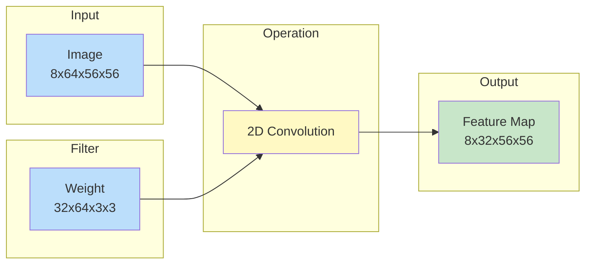
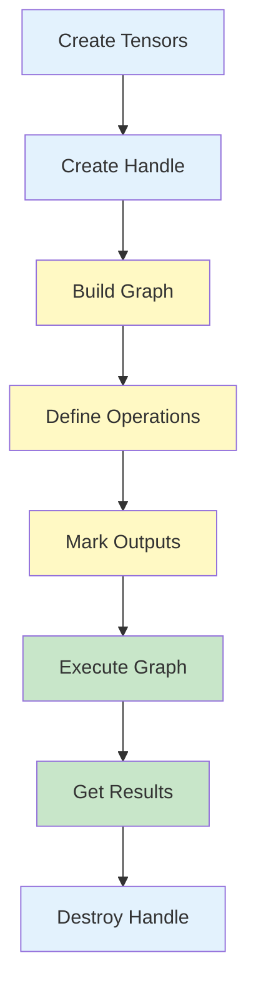

# Your First cuDNN Graph

Let's build your first cuDNN Frontend graph step by step. By the end of this tutorial, you'll understand the fundamental workflow.

## The Goal

We'll implement a simple **2D convolution** - the workhorse of computer vision. This operation slides a filter over an image to detect features:



## Step 1: Import Libraries

```python
import cudnn
import torch

# Optional: Set random seed for reproducibility
torch.manual_seed(42)
```

!!! info "Why PyTorch?"
    We use PyTorch to create GPU tensors, but cuDNN Frontend works with any DLPack-compatible tensor library (CuPy, JAX, etc.).

## Step 2: Create Input Tensors

First, let's create our input data on the GPU:

```python
# Ensure we have a GPU
assert torch.cuda.is_available(), "CUDA GPU required!"

# Create input image tensor
# Shape: [batch, channels, height, width] = [8, 64, 56, 56]
x = torch.randn(
    8, 64, 56, 56,
    device="cuda",
    dtype=torch.float16
).to(memory_format=torch.channels_last)  # NHWC physical layout

# Create weight/filter tensor
# Shape: [out_channels, in_channels, kernel_h, kernel_w] = [32, 64, 3, 3]
w = torch.randn(
    32, 64, 3, 3,
    device="cuda",
    dtype=torch.float16
).to(memory_format=torch.channels_last)

print(f"Input shape: {x.shape}")   # [8, 64, 56, 56]
print(f"Weight shape: {w.shape}")  # [32, 64, 3, 3]
```

!!! warning "Memory Layout Matters"
    cuDNN expects **channels-last** (NHWC) physical layout for optimal performance. The `.to(memory_format=torch.channels_last)` call handles this.

    ```
    NCHW (logical): [batch, channels, height, width]
    NHWC (physical): [batch, height, width, channels]
    ```

## Step 3: Create a cuDNN Handle

The handle manages GPU context and resources:

```python
handle = cudnn.create_handle()
```

Think of the handle as your "connection" to the GPU for cuDNN operations.

## Step 4: Build the Graph

Here's where the magic happens. We use a context manager to build our computation graph:

```python
with cudnn.Graph(
    io_data_type=cudnn.data_type.HALF,        # FP16 inputs/outputs
    compute_data_type=cudnn.data_type.FLOAT,  # FP32 internal math
) as graph:

    # Add a convolution operation
    y = graph.conv_fprop(
        image=x,           # Input tensor (provides shape info)
        weight=w,          # Weight tensor (provides shape info)
        padding=[1, 1],    # Padding on each side
        stride=[1, 1],     # Step size
        dilation=[1, 1],   # Kernel spacing
    )

    # Mark output tensor
    y.set_output(True)
```

Let's break this down:

| Line | Purpose |
|------|---------|
| `cudnn.Graph(...)` | Creates a new computation graph |
| `io_data_type=HALF` | Input/output tensors are FP16 |
| `compute_data_type=FLOAT` | Internal calculations use FP32 for accuracy |
| `conv_fprop(...)` | Adds a forward convolution operation |
| `set_output(True)` | Marks `y` as an output we want to retrieve |

## Step 5: Execute the Graph

With the graph built, execution is simple:

```python
# Execute the graph
result = graph(x, w, handle=handle)

print(f"Output shape: {result.shape}")  # [8, 32, 56, 56]
```

That's it! The graph:

1. Analyzed your operations
2. Found the optimal algorithm
3. Allocated workspace memory
4. Executed on the GPU

## Step 6: Verify Results

Let's compare with PyTorch's native convolution:

```python
# PyTorch reference
reference = torch.nn.functional.conv2d(x, w, padding=1)

# Compare results
torch.testing.assert_close(result, reference, atol=5e-3, rtol=3e-3)
print("Results match PyTorch!")
```

## Step 7: Clean Up

Don't forget to release resources:

```python
cudnn.destroy_handle(handle)
```

## Complete Code

Here's the full example:

```python
import cudnn
import torch

torch.manual_seed(42)
assert torch.cuda.is_available()

# Create input tensors
x = torch.randn(8, 64, 56, 56, device="cuda", dtype=torch.float16).to(
    memory_format=torch.channels_last
)
w = torch.randn(32, 64, 3, 3, device="cuda", dtype=torch.float16).to(
    memory_format=torch.channels_last
)

# Create handle
handle = cudnn.create_handle()

# Build graph
with cudnn.Graph(
    io_data_type=cudnn.data_type.HALF,
    compute_data_type=cudnn.data_type.FLOAT,
) as graph:
    y = graph.conv_fprop(
        image=x, weight=w,
        padding=[1, 1], stride=[1, 1], dilation=[1, 1]
    )
    y.set_output(True)

# Execute
result = graph(x, w, handle=handle)

# Verify
reference = torch.nn.functional.conv2d(x, w, padding=1)
torch.testing.assert_close(result, reference, atol=5e-3, rtol=3e-3)
print(f"Success! Output shape: {result.shape}")

# Clean up
cudnn.destroy_handle(handle)
```

## Understanding the Workflow



The workflow is:

1. **Setup** - Create tensors and handle
2. **Build** - Define your computation graph
3. **Execute** - Run on GPU
4. **Cleanup** - Release resources

## Key Takeaways

!!! success "What You Learned"
    1. cuDNN graphs describe computations declaratively
    2. Tensors can be reused for shape/type inference
    3. The graph handles all optimization automatically
    4. Results are compatible with PyTorch tensors

## Common Mistakes

!!! failure "Forgetting `set_output(True)`"
    If you don't mark tensors as outputs, you won't be able to retrieve them!

!!! failure "Wrong memory layout"
    Most cuDNN operations expect channels-last (NHWC) layout. Use `.to(memory_format=torch.channels_last)`.

!!! failure "Not destroying handle"
    Always call `cudnn.destroy_handle(handle)` to prevent memory leaks.

## Next Steps

Now that you understand the basics, let's explore more features!

[Quick Start Guide :material-arrow-right:](quickstart.md){ .md-button .md-button--primary }
