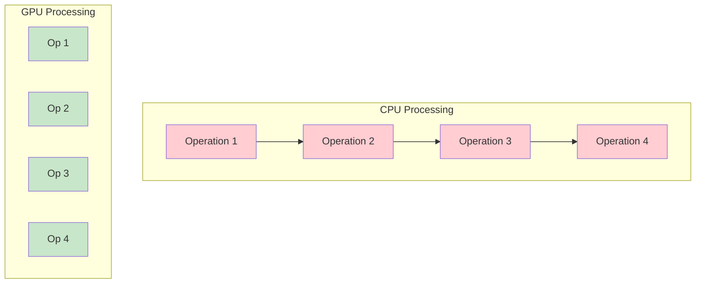
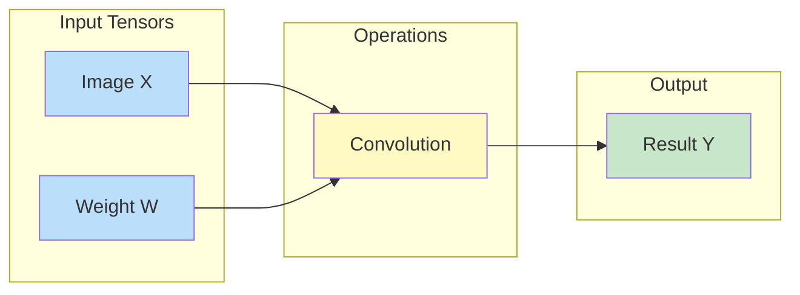

# Introduction to cuDNN Frontend

## The Story of Deep Learning Acceleration

Let's start with a question: **Why do we need cuDNN Frontend?**

When you train a neural network, you're essentially doing millions of mathematical operations - matrix multiplications, convolutions, normalizations, and more. Your CPU could do these, but it would be painfully slow.



**CPUs process operations one at a time. GPUs process thousands in parallel.** This is why modern AI runs on GPUs.

## What is cuDNN?

**cuDNN** (CUDA Deep Neural Network library) is NVIDIA's secret weapon for deep learning. It's a GPU-accelerated library of primitives for:

- Convolutions
- Matrix multiplications
- Activation functions
- Normalization
- Attention mechanisms
- And much more...

!!! info "cuDNN Powers Everything"
    When you run PyTorch, TensorFlow, or any major deep learning framework on NVIDIA GPUs, cuDNN is doing the heavy lifting under the hood.

## The Problem: cuDNN is Complex

Directly using cuDNN requires you to:

1. Create and configure tensor descriptors
2. Create operation descriptors
3. Query the runtime for supported configurations
4. Allocate workspace memory
5. Execute operations
6. Handle errors at every step

Here's what that might look like (simplified):

```c
// Don't worry if this looks intimidating - that's the point!
cudnnTensorDescriptor_t xDesc, yDesc;
cudnnFilterDescriptor_t wDesc;
cudnnConvolutionDescriptor_t convDesc;

cudnnCreateTensorDescriptor(&xDesc);
cudnnSetTensor4dDescriptor(xDesc, CUDNN_TENSOR_NCHW, CUDNN_DATA_FLOAT, n, c, h, w);
// ... many more lines of setup code ...
cudnnConvolutionForward(handle, &alpha, xDesc, x, wDesc, w, convDesc,
                        algo, workspace, workspaceSize, &beta, yDesc, y);
```

**That's a lot of code just for one convolution!** And we haven't even handled errors yet.

## The Solution: cuDNN Frontend

cuDNN Frontend wraps all that complexity in an elegant, graph-based API:

```python
# The same convolution, using cuDNN Frontend
with cudnn.Graph() as graph:
    y = graph.conv_fprop(image=x, weight=w, padding=[1, 1])
    y.set_output(True)

result = graph(x, w)  # Done!
```

**Three lines. That's it.**

## The Graph Concept

The key innovation in cuDNN Frontend is the **Graph API**. Instead of thinking about individual operations, you describe your computation as a graph:



This approach has several advantages:

| Advantage | Description |
|-----------|-------------|
| **Optimization** | cuDNN can analyze your entire graph and find the best execution strategy |
| **Fusion** | Multiple operations can be combined into one efficient kernel |
| **Reusability** | Build a graph once, execute it millions of times |
| **Clarity** | Your code clearly describes what you want, not how to do it |

## Real-World Impact

Let's look at a more realistic example - the attention mechanism used in transformers:

=== "Traditional Approach"

    ```python
    # Implementing attention manually is complex
    scores = torch.matmul(query, key.transpose(-2, -1))
    scores = scores / math.sqrt(d_k)
    scores = torch.softmax(scores, dim=-1)
    scores = torch.dropout(scores, p=0.1)
    output = torch.matmul(scores, value)
    # Multiple operations, multiple memory transfers
    ```

=== "cuDNN Frontend"

    ```python
    # cuDNN Frontend fuses everything into one optimized operation
    with cudnn.Graph() as graph:
        output, _ = graph.sdpa(q=query, k=key, v=value,
                               attn_scale=1/math.sqrt(d_k))
        output.set_output(True)

    result = graph(query, key, value)
    # One operation, maximum performance
    ```

The cuDNN Frontend version is not just cleaner - it's **significantly faster** because:

1. All operations are fused into a single GPU kernel
2. Intermediate results stay in fast GPU registers
3. Memory bandwidth is minimized

## What You'll Learn

In this guide, you'll learn:

1. **Installation** - How to set up cuDNN Frontend
2. **Core Concepts** - Understanding graphs, tensors, and operations
3. **Practical Usage** - Building real operations for your models
4. **Best Practices** - Tips for maximum performance

## Next Steps

Ready to get started? Let's set up your environment!

[Install cuDNN Frontend :material-arrow-right:](installation.md){ .md-button .md-button--primary }
