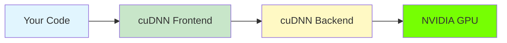

# Welcome to cuDNN Frontend

<div style="text-align: center; padding: 20px;">

</div>

## What is cuDNN Frontend?

**cuDNN Frontend** is your gateway to GPU-accelerated deep learning. It provides a simple, intuitive interface to harness the power of NVIDIA's cuDNN library - the same technology powering the world's fastest AI systems.

!!! tip "Think of it like this"
    If cuDNN is the engine of a race car, cuDNN Frontend is the steering wheel and dashboard that lets you drive it effortlessly.

## Why Should You Care?

| Without cuDNN Frontend | With cuDNN Frontend |
|------------------------|---------------------|
| Write hundreds of lines of boilerplate code | Write 10-20 lines of clean code |
| Manually manage tensor layouts and memory | Automatic layout inference |
| Figure out optimal algorithms yourself | Built-in autotuning |
| Debug cryptic error messages | Clear, actionable feedback |

## The Big Picture



cuDNN Frontend sits between your code and the powerful cuDNN backend, translating your high-level intentions into optimized GPU operations.

## Key Features at a Glance

<div class="grid cards" markdown>

-   :material-graph: **Graph-Based API**

    ---

    Build once, run many times. Describe your operations as a graph and let cuDNN optimize execution.

-   :material-language-python: **Python & C++ Support**

    ---

    Choose your language. Both APIs are functionally equivalent and easy to use.

-   :material-speedometer: **Automatic Optimization**

    ---

    Built-in heuristics and autotuning find the fastest implementation for your hardware.

-   :material-memory: **Smart Memory Management**

    ---

    Automatic workspace allocation and tensor management.

</div>

## Who Is This Guide For?

This guide is designed for:

- **ML Engineers** who want to squeeze every drop of performance from their models
- **Researchers** exploring custom operations and architectures
- **Developers** building production AI systems
- **Students** learning about GPU computing and deep learning internals

!!! note "Prerequisites"
    - Basic Python or C++ knowledge
    - Understanding of basic deep learning concepts (tensors, convolutions, attention)
    - Access to an NVIDIA GPU (Ampere or newer recommended)

## Quick Example

Here's a taste of how simple cuDNN Frontend can be:

=== "Python"

    ```python
    import cudnn
    import torch

    # Create input tensors
    x = torch.randn(8, 64, 56, 56, device="cuda", dtype=torch.float16)
    w = torch.randn(32, 64, 3, 3, device="cuda", dtype=torch.float16)

    # Build and execute a convolution graph
    with cudnn.Graph() as graph:
        output = graph.conv_fprop(image=x, weight=w, padding=[1,1])
        output.set_output(True)

    result = graph(x, w)  # That's it!
    ```

=== "C++"

    ```cpp
    #include <cudnn_frontend.h>

    // Create a graph
    auto graph = cudnn_frontend::graph::Graph();
    graph.set_io_data_type(cudnn::DataType_t::HALF);

    // Add convolution operation
    auto conv = graph.conv_fprop(X, W, Conv_options);
    conv->set_output(true);

    // Build and execute
    graph.build();
    graph.execute(handle, variant_pack, workspace);
    ```

## Ready to Start?

<div class="grid cards" markdown>

-   :material-rocket-launch: [**Getting Started**](getting-started/introduction.md)

    ---

    New to cuDNN Frontend? Start here!

-   :material-school: [**Core Concepts**](concepts/graphs.md)

    ---

    Understand the fundamentals.

-   :material-code-braces: [**Tutorials**](tutorials/convolution.md)

    ---

    Learn by building real operations.

</div>

---

*cuDNN Frontend is open source. [View on GitHub](https://github.com/NVIDIA/cudnn-frontend)*
