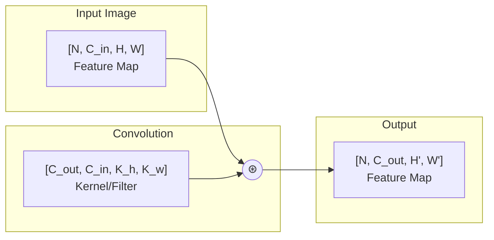

# Convolution Operations Tutorial

Convolutions are the backbone of computer vision deep learning. This tutorial covers everything you need to know about using convolutions with cuDNN Frontend.

## What is a Convolution?

A convolution slides a small filter (kernel) over an input image to produce feature maps:



## Forward Convolution (Training & Inference)

### Basic Forward Pass

```python
import cudnn
import torch

torch.manual_seed(42)
device = torch.device("cuda")
handle = cudnn.create_handle()

# Input: [batch=16, channels=64, height=56, width=56]
x = torch.randn(16, 64, 56, 56, device=device, dtype=torch.float16).to(
    memory_format=torch.channels_last
)

# Kernel: [out_channels=128, in_channels=64, kernel_h=3, kernel_w=3]
w = torch.randn(128, 64, 3, 3, device=device, dtype=torch.float16).to(
    memory_format=torch.channels_last
)

# Build convolution graph
with cudnn.Graph(
    io_data_type=cudnn.data_type.HALF,
    compute_data_type=cudnn.data_type.FLOAT,
) as graph:
    y = graph.conv_fprop(
        image=x,
        weight=w,
        padding=[1, 1],    # Same padding for 3x3 kernel
        stride=[1, 1],
        dilation=[1, 1],
    )
    y.set_output(True)

# Execute
output = graph(x, w, handle=handle)
print(f"Output shape: {output.shape}")  # [16, 128, 56, 56]
```

### Understanding Convolution Parameters

#### Padding

Controls output size and handles border pixels:

```python
# No padding: output shrinks
y = graph.conv_fprop(x, w, padding=[0, 0])
# Input [N, C, 56, 56] → Output [N, C', 54, 54]

# Same padding: output same size (for stride=1)
y = graph.conv_fprop(x, w, padding=[1, 1])  # For 3x3 kernel
# Input [N, C, 56, 56] → Output [N, C', 56, 56]

# Full padding: maximum output
y = graph.conv_fprop(x, w, padding=[2, 2])  # For 3x3 kernel
# Input [N, C, 56, 56] → Output [N, C', 58, 58]
```

**Padding formula for "same" output**: `padding = (kernel_size - 1) // 2`

#### Stride

Controls step size of the convolution:

```python
# Stride 1: dense computation
y = graph.conv_fprop(x, w, padding=[1, 1], stride=[1, 1])
# Input [N, C, 56, 56] → Output [N, C', 56, 56]

# Stride 2: downsamples by 2x
y = graph.conv_fprop(x, w, padding=[1, 1], stride=[2, 2])
# Input [N, C, 56, 56] → Output [N, C', 28, 28]
```

**Output size formula**: `output_size = (input_size + 2*padding - kernel_size) // stride + 1`

#### Dilation

Controls spacing between kernel elements:

```python
# Standard convolution
y = graph.conv_fprop(x, w, padding=[1, 1], dilation=[1, 1])
# 3x3 kernel covers 3x3 area

# Dilated convolution (atrous)
y = graph.conv_fprop(x, w, padding=[2, 2], dilation=[2, 2])
# 3x3 kernel covers 5x5 area with gaps
```

## Convolution with Bias and Activation

The most common pattern is `Conv → Bias → Activation`:

```python
# Additional tensors
bias = torch.randn(1, 128, 1, 1, device=device, dtype=torch.float16).to(
    memory_format=torch.channels_last
)

with cudnn.Graph(
    io_data_type=cudnn.data_type.HALF,
    compute_data_type=cudnn.data_type.FLOAT,
) as graph:
    # Convolution
    conv_out = graph.conv_fprop(x, w, padding=[1, 1])

    # Add bias
    bias_out = graph.bias(input=conv_out, bias=bias)

    # ReLU activation
    relu_out = graph.relu(input=bias_out)
    relu_out.set_output(True)

# All operations are fused into a single kernel!
output = graph(x, w, bias, handle=handle)
```

## Backward Pass (Training)

For training, you need gradients for both inputs and weights.

### Data Gradient (dgrad)

Computes gradient with respect to input:

```python
# Forward pass first
x = torch.randn(16, 64, 56, 56, device=device, dtype=torch.float16).to(
    memory_format=torch.channels_last
)
w = torch.randn(128, 64, 3, 3, device=device, dtype=torch.float16).to(
    memory_format=torch.channels_last
)

# Gradient flowing back from next layer
dy = torch.randn(16, 128, 56, 56, device=device, dtype=torch.float16).to(
    memory_format=torch.channels_last
)

# Compute input gradient
with cudnn.Graph(
    io_data_type=cudnn.data_type.HALF,
    compute_data_type=cudnn.data_type.FLOAT,
) as graph:
    dx = graph.conv_dgrad(
        weight=w,
        loss=dy,
        padding=[1, 1],
        stride=[1, 1],
        dilation=[1, 1],
    )
    dx.set_output(True)

# Execute
input_grad = graph(w, dy, handle=handle)
print(f"Input gradient shape: {input_grad.shape}")  # [16, 64, 56, 56]
```

### Weight Gradient (wgrad)

Computes gradient with respect to weights:

```python
with cudnn.Graph(
    io_data_type=cudnn.data_type.HALF,
    compute_data_type=cudnn.data_type.FLOAT,
) as graph:
    dw = graph.conv_wgrad(
        image=x,
        loss=dy,
        padding=[1, 1],
        stride=[1, 1],
        dilation=[1, 1],
    )
    dw.set_output(True)

# Execute
weight_grad = graph(x, dy, handle=handle)
print(f"Weight gradient shape: {weight_grad.shape}")  # [128, 64, 3, 3]
```

### Combined Forward and Backward

For training loops, you typically need all three:

```python
# Forward graph
with cudnn.Graph(name="forward") as forward_graph:
    y = graph.conv_fprop(x, w, padding=[1, 1])
    y.set_output(True)

# Backward input gradient graph
with cudnn.Graph(name="dgrad") as dgrad_graph:
    dx = graph.conv_dgrad(w, dy, padding=[1, 1])
    dx.set_output(True)

# Backward weight gradient graph
with cudnn.Graph(name="wgrad") as wgrad_graph:
    dw = graph.conv_wgrad(x, dy, padding=[1, 1])
    dw.set_output(True)

# Training loop
for epoch in range(num_epochs):
    for batch in dataloader:
        # Forward
        y = forward_graph(batch.x, w, handle=handle)

        # Compute loss and get dy
        loss = criterion(y, batch.target)
        dy = loss.backward()  # Or manual gradient

        # Backward
        dx = dgrad_graph(w, dy, handle=handle)
        dw = wgrad_graph(batch.x, dy, handle=handle)

        # Update weights
        w -= learning_rate * dw
```

## Different Kernel Sizes

### 1x1 Convolution (Pointwise)

Used for channel projection without spatial mixing:

```python
# 1x1 kernel for channel reduction
w_1x1 = torch.randn(64, 256, 1, 1, device=device, dtype=torch.float16).to(
    memory_format=torch.channels_last
)

with cudnn.Graph() as graph:
    y = graph.conv_fprop(x, w_1x1, padding=[0, 0])  # No padding needed
    y.set_output(True)
# Reduces 256 channels to 64
```

### 3x3 Convolution

The workhorse of CNNs:

```python
w_3x3 = torch.randn(128, 64, 3, 3, device=device, dtype=torch.float16).to(
    memory_format=torch.channels_last
)

with cudnn.Graph() as graph:
    y = graph.conv_fprop(x, w_3x3, padding=[1, 1])  # Same padding
    y.set_output(True)
```

### 5x5, 7x7 Convolutions

Larger receptive fields:

```python
# 7x7 convolution (common in first layer)
w_7x7 = torch.randn(64, 3, 7, 7, device=device, dtype=torch.float16).to(
    memory_format=torch.channels_last
)

with cudnn.Graph() as graph:
    y = graph.conv_fprop(x, w_7x7, padding=[3, 3], stride=[2, 2])
    y.set_output(True)
```

## Depthwise Convolution

Used in MobileNets and EfficientNets:

```python
# Each channel processed independently
# groups = in_channels = out_channels
in_channels = 64

# Depthwise: [out, in_per_group, kH, kW] = [64, 1, 3, 3]
w_dw = torch.randn(64, 1, 3, 3, device=device, dtype=torch.float16).to(
    memory_format=torch.channels_last
)

with cudnn.Graph() as graph:
    y = graph.conv_fprop(
        x, w_dw,
        padding=[1, 1],
        groups=in_channels,  # Key parameter for depthwise
    )
    y.set_output(True)
```

## Transposed Convolution

For upsampling (used in autoencoders, GANs):

```python
# Transposed convolution increases spatial dimensions
# Input: [N, 128, 14, 14] → Output: [N, 64, 28, 28]

x_small = torch.randn(16, 128, 14, 14, device=device, dtype=torch.float16).to(
    memory_format=torch.channels_last
)
w_up = torch.randn(128, 64, 4, 4, device=device, dtype=torch.float16).to(
    memory_format=torch.channels_last
)

# Note: Use dgrad for transposed convolution
with cudnn.Graph() as graph:
    y = graph.conv_dgrad(
        weight=w_up,
        loss=x_small,  # The "input" goes where loss would be
        padding=[1, 1],
        stride=[2, 2],
    )
    y.set_output(True)

output = graph(w_up, x_small, handle=handle)
print(f"Upsampled shape: {output.shape}")  # [16, 64, 28, 28]
```

## ResNet Block Example

Complete example of a residual block:

```python
def resnet_basic_block(graph, x, w1, w2, bn1_params, bn2_params, downsample_w=None):
    """
    Basic ResNet block:
    x → Conv → BN → ReLU → Conv → BN → (+x) → ReLU
    """
    identity = x

    # First conv + bn + relu
    out = graph.conv_fprop(x, w1, padding=[1, 1])
    out = graph.batchnorm_inference(
        out, bn1_params.scale, bn1_params.bias,
        bn1_params.mean, bn1_params.inv_var
    )
    out = graph.relu(out)

    # Second conv + bn
    out = graph.conv_fprop(out, w2, padding=[1, 1])
    out = graph.batchnorm_inference(
        out, bn2_params.scale, bn2_params.bias,
        bn2_params.mean, bn2_params.inv_var
    )

    # Downsample if needed
    if downsample_w is not None:
        identity = graph.conv_fprop(identity, downsample_w, stride=[2, 2])

    # Residual connection
    out = graph.add(out, identity)
    out = graph.relu(out)

    return out
```

## Performance Tips

!!! tip "Convolution Optimization"

    1. **Use channels-last**: Always use NHWC layout
    2. **Fuse operations**: Combine Conv + Bias + Activation
    3. **Power-of-2 channels**: 64, 128, 256 are fastest
    4. **Avoid small batches**: Batch size > 32 recommended
    5. **Consider Winograd**: cuDNN auto-selects for 3x3

## Verification with PyTorch

Always verify your implementation:

```python
# cuDNN Frontend
with cudnn.Graph() as graph:
    y = graph.conv_fprop(x, w, padding=[1, 1])
    y.set_output(True)
cudnn_result = graph(x, w, handle=handle)

# PyTorch reference
pytorch_result = torch.nn.functional.conv2d(x, w, padding=1)

# Compare
torch.testing.assert_close(cudnn_result, pytorch_result, atol=5e-3, rtol=3e-3)
print("Results match!")
```

## Cleanup

```python
cudnn.destroy_handle(handle)
```

## Next Steps

Learn about matrix multiplication operations.

[Matrix Multiplication Tutorial :material-arrow-right:](matmul.md){ .md-button .md-button--primary }
