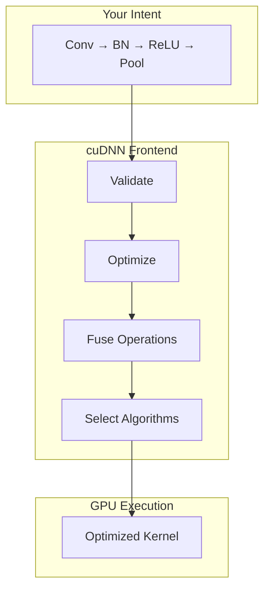

# Building Custom Graphs Tutorial

Now that you understand individual operations, let's combine them into custom computation graphs. This is where cuDNN Frontend's power really shines.

## Graph Building Philosophy

The key insight: **Describe what you want, not how to do it.**



## Building Blocks

### Sequential Operations

```python
import cudnn
import torch
import math

handle = cudnn.create_handle()
device = torch.device("cuda")

# Build a sequential CNN block
x = torch.randn(16, 64, 56, 56, device=device, dtype=torch.float16).to(
    memory_format=torch.channels_last
)
w1 = torch.randn(128, 64, 3, 3, device=device, dtype=torch.float16).to(
    memory_format=torch.channels_last
)
w2 = torch.randn(128, 128, 3, 3, device=device, dtype=torch.float16).to(
    memory_format=torch.channels_last
)

with cudnn.Graph(
    io_data_type=cudnn.data_type.HALF,
    compute_data_type=cudnn.data_type.FLOAT,
) as graph:
    # First conv + relu
    h1 = graph.conv_fprop(x, w1, padding=[1, 1])
    h1 = graph.relu(h1)

    # Second conv + relu
    h2 = graph.conv_fprop(h1, w2, padding=[1, 1])
    h2 = graph.relu(h2)

    h2.set_output(True)

result = graph(x, w1, w2, handle=handle)
```

### Residual Connections

```python
shortcut_w = torch.randn(128, 64, 1, 1, device=device, dtype=torch.float16).to(
    memory_format=torch.channels_last
)

with cudnn.Graph(
    io_data_type=cudnn.data_type.HALF,
    compute_data_type=cudnn.data_type.FLOAT,
) as graph:
    # Main path
    h = graph.conv_fprop(x, w1, padding=[1, 1])
    h = graph.relu(h)
    h = graph.conv_fprop(h, w2, padding=[1, 1])

    # Shortcut path (1x1 conv for channel matching)
    shortcut = graph.conv_fprop(x, shortcut_w)

    # Residual addition
    out = graph.add(h, shortcut)
    out = graph.relu(out)
    out.set_output(True)

result = graph(x, w1, w2, shortcut_w, handle=handle)
```

### Parallel Paths (Inception-style)

```python
w_1x1 = torch.randn(32, 64, 1, 1, device=device, dtype=torch.float16).to(
    memory_format=torch.channels_last
)
w_3x3 = torch.randn(64, 64, 3, 3, device=device, dtype=torch.float16).to(
    memory_format=torch.channels_last
)
w_5x5 = torch.randn(32, 64, 5, 5, device=device, dtype=torch.float16).to(
    memory_format=torch.channels_last
)

with cudnn.Graph() as graph:
    # Path 1: 1x1 conv
    path1 = graph.conv_fprop(x, w_1x1)
    path1 = graph.relu(path1)

    # Path 2: 3x3 conv
    path2 = graph.conv_fprop(x, w_3x3, padding=[1, 1])
    path2 = graph.relu(path2)

    # Path 3: 5x5 conv
    path3 = graph.conv_fprop(x, w_5x5, padding=[2, 2])
    path3 = graph.relu(path3)

    # Concatenate along channel dimension
    # Note: concat might need manual implementation
    # For now, we output all three
    path1.set_output(True).set_name("path1")
    path2.set_output(True).set_name("path2")
    path3.set_output(True).set_name("path3")
```

## Complete Network Blocks

### MLP Block

```python
hidden_dim = 768
ff_dim = 3072

x_mlp = torch.randn(8, 1024, hidden_dim, device=device, dtype=torch.float16)
W1 = torch.randn(hidden_dim, ff_dim, device=device, dtype=torch.float16)
W2 = torch.randn(ff_dim, hidden_dim, device=device, dtype=torch.float16)
b1 = torch.randn(ff_dim, device=device, dtype=torch.float16)
b2 = torch.randn(hidden_dim, device=device, dtype=torch.float16)

with cudnn.Graph(
    io_data_type=cudnn.data_type.HALF,
    compute_data_type=cudnn.data_type.FLOAT,
) as graph:
    # First linear + GELU
    h = graph.matmul(x_mlp, W1)
    h = graph.add(h, b1.view(1, 1, -1))
    h = graph.gelu(h)

    # Second linear
    out = graph.matmul(h, W2)
    out = graph.add(out, b2.view(1, 1, -1))
    out.set_output(True)

result = graph(x_mlp, W1, W2, b1.view(1, 1, -1), b2.view(1, 1, -1), handle=handle)
```

### Complete Transformer Block

```python
class CudnnTransformerBlock:
    def __init__(self, hidden_dim, num_heads, ff_dim, handle):
        self.hidden_dim = hidden_dim
        self.num_heads = num_heads
        self.head_dim = hidden_dim // num_heads
        self.ff_dim = ff_dim
        self.handle = handle
        self.attn_scale = 1.0 / math.sqrt(self.head_dim)

        # Initialize weights (normally nn.Parameter)
        self.ln1_gamma = torch.ones(hidden_dim, device="cuda", dtype=torch.float32)
        self.ln1_beta = torch.zeros(hidden_dim, device="cuda", dtype=torch.float32)
        self.ln2_gamma = torch.ones(hidden_dim, device="cuda", dtype=torch.float32)
        self.ln2_beta = torch.zeros(hidden_dim, device="cuda", dtype=torch.float32)

        self.W_qkv = torch.randn(hidden_dim, 3 * hidden_dim, device="cuda", dtype=torch.float16)
        self.W_out = torch.randn(hidden_dim, hidden_dim, device="cuda", dtype=torch.float16)
        self.W_ff1 = torch.randn(hidden_dim, ff_dim, device="cuda", dtype=torch.float16)
        self.W_ff2 = torch.randn(ff_dim, hidden_dim, device="cuda", dtype=torch.float16)

    def forward(self, x):
        batch, seq_len, _ = x.shape

        # === Self-Attention Sub-layer ===
        residual = x

        # Pre-LayerNorm
        with cudnn.Graph(io_data_type=cudnn.data_type.HALF,
                         compute_data_type=cudnn.data_type.FLOAT) as ln1_graph:
            x_norm, _, _ = ln1_graph.layernorm(x, self.ln1_gamma, self.ln1_beta, 1e-5)
            x_norm.set_output(True)
        x_norm = ln1_graph(x, self.ln1_gamma, self.ln1_beta, handle=self.handle)

        # QKV projection
        qkv = x_norm @ self.W_qkv
        q, k, v = qkv.chunk(3, dim=-1)
        q = q.view(batch, seq_len, self.num_heads, self.head_dim).transpose(1, 2)
        k = k.view(batch, seq_len, self.num_heads, self.head_dim).transpose(1, 2)
        v = v.view(batch, seq_len, self.num_heads, self.head_dim).transpose(1, 2)

        # SDPA
        with cudnn.Graph(io_data_type=cudnn.data_type.HALF,
                         intermediate_data_type=cudnn.data_type.FLOAT,
                         compute_data_type=cudnn.data_type.FLOAT) as attn_graph:
            attn_out, _ = attn_graph.sdpa(q, k, v, attn_scale=self.attn_scale,
                                           is_inference=True, use_causal_mask=True)
            attn_out.set_output(True).set_dim(q.shape).set_stride(q.stride())

        attn_out = attn_graph(q, k, v, handle=self.handle)
        attn_out = attn_out.transpose(1, 2).contiguous().view(batch, seq_len, -1)

        # Output projection and residual
        attn_out = attn_out @ self.W_out
        x = residual + attn_out

        # === FFN Sub-layer ===
        residual = x

        # Pre-LayerNorm
        with cudnn.Graph(io_data_type=cudnn.data_type.HALF,
                         compute_data_type=cudnn.data_type.FLOAT) as ln2_graph:
            x_norm, _, _ = ln2_graph.layernorm(x, self.ln2_gamma, self.ln2_beta, 1e-5)
            x_norm.set_output(True)
        x_norm = ln2_graph(x, self.ln2_gamma, self.ln2_beta, handle=self.handle)

        # FFN
        with cudnn.Graph(io_data_type=cudnn.data_type.HALF,
                         compute_data_type=cudnn.data_type.FLOAT) as ffn_graph:
            h = ffn_graph.matmul(x_norm, self.W_ff1)
            h = ffn_graph.gelu(h)
            ff_out = ffn_graph.matmul(h, self.W_ff2)
            ff_out.set_output(True)
        ff_out = ffn_graph(x_norm, self.W_ff1, self.W_ff2, handle=self.handle)

        # Residual
        x = residual + ff_out

        return x
```

## Graph Caching Pattern

Build graphs once, execute many times:

```python
class GraphCache:
    def __init__(self):
        self.cache = {}

    def get_or_build(self, key, builder_fn):
        if key not in self.cache:
            self.cache[key] = builder_fn()
        return self.cache[key]

# Usage
cache = GraphCache()

def build_conv_graph(in_ch, out_ch, kernel_size):
    def builder():
        x = torch.randn(1, in_ch, 56, 56, device="cuda", dtype=torch.float16).to(
            memory_format=torch.channels_last)
        w = torch.randn(out_ch, in_ch, kernel_size, kernel_size,
                        device="cuda", dtype=torch.float16).to(memory_format=torch.channels_last)

        with cudnn.Graph() as graph:
            y = graph.conv_fprop(x, w, padding=[kernel_size//2, kernel_size//2])
            y.set_output(True)
        return graph
    return builder

# Get or build
key = (64, 128, 3)  # (in_ch, out_ch, kernel)
graph = cache.get_or_build(key, build_conv_graph(*key))

# Execute (fast - graph already built)
result = graph(x_actual, w_actual, handle=handle)
```

## Dynamic Shapes with Graph Templates

For varying batch sizes:

```python
def create_flexible_graph(max_batch_size, channels, height, width):
    """Create a graph that works for any batch size up to max_batch_size."""
    template_x = torch.randn(max_batch_size, channels, height, width,
                              device="cuda", dtype=torch.float16).to(
                                  memory_format=torch.channels_last)
    template_w = torch.randn(channels*2, channels, 3, 3,
                              device="cuda", dtype=torch.float16).to(
                                  memory_format=torch.channels_last)

    with cudnn.Graph() as graph:
        y = graph.conv_fprop(template_x, template_w, padding=[1, 1])
        y.set_output(True)

    return graph

# Create once
max_graph = create_flexible_graph(64, 64, 56, 56)

# Execute with different batch sizes
for batch_size in [8, 16, 32, 64]:
    x = torch.randn(batch_size, 64, 56, 56, device="cuda", dtype=torch.float16).to(
        memory_format=torch.channels_last)
    w = torch.randn(128, 64, 3, 3, device="cuda", dtype=torch.float16).to(
        memory_format=torch.channels_last)
    # This may need graph rebuild for different sizes
    result = max_graph(x, w, handle=handle)
```

## Error Handling

```python
def safe_build_graph(x, w):
    try:
        with cudnn.Graph() as graph:
            y = graph.conv_fprop(x, w, padding=[1, 1])
            y.set_output(True)
        return graph, None
    except Exception as e:
        return None, str(e)

# Usage
graph, error = safe_build_graph(x, w)
if error:
    print(f"Graph build failed: {error}")
    # Fall back to PyTorch
    result = torch.nn.functional.conv2d(x, w, padding=1)
else:
    result = graph(x, w, handle=handle)
```

## Debugging Custom Graphs

```python
# Enable verbose logging
import os
os.environ["CUDNN_FRONTEND_LOG_INFO"] = "1"
os.environ["CUDNN_FRONTEND_LOG_FILE"] = "stdout"

# Build and inspect
with cudnn.Graph() as graph:
    h = graph.conv_fprop(x, w, padding=[1, 1], name="conv1")
    h = graph.relu(h, name="relu1")
    h = graph.conv_fprop(h, w2, padding=[1, 1], name="conv2")
    h.set_output(True).set_name("output")

# Print graph structure
print(graph)
```

## Best Practices Summary

!!! success "Custom Graph Best Practices"

    1. **Plan your graph topology** before coding
    2. **Name operations** for debugging
    3. **Cache graphs** - don't rebuild unnecessarily
    4. **Test incrementally** - verify each subgraph
    5. **Use virtual tensors** - minimize memory
    6. **Fuse aggressively** - combine operations
    7. **Profile first** - identify bottlenecks before optimizing

## Complete Example: Mini ResNet Block

```python
def create_resnet_block_graph(in_channels, out_channels, stride, handle):
    """
    Creates a complete ResNet basic block graph.

    Structure:
    x -> Conv3x3 -> BN -> ReLU -> Conv3x3 -> BN -> (+shortcut) -> ReLU -> y
    """
    # Template tensors
    x = torch.randn(16, in_channels, 56, 56, device="cuda", dtype=torch.float16).to(
        memory_format=torch.channels_last)
    w1 = torch.randn(out_channels, in_channels, 3, 3, device="cuda", dtype=torch.float16).to(
        memory_format=torch.channels_last)
    w2 = torch.randn(out_channels, out_channels, 3, 3, device="cuda", dtype=torch.float16).to(
        memory_format=torch.channels_last)

    # BN parameters
    gamma1 = torch.ones(out_channels, device="cuda", dtype=torch.float32)
    beta1 = torch.zeros(out_channels, device="cuda", dtype=torch.float32)
    gamma2 = torch.ones(out_channels, device="cuda", dtype=torch.float32)
    beta2 = torch.zeros(out_channels, device="cuda", dtype=torch.float32)

    downsample = in_channels != out_channels or stride != 1
    if downsample:
        w_ds = torch.randn(out_channels, in_channels, 1, 1, device="cuda", dtype=torch.float16).to(
            memory_format=torch.channels_last)

    with cudnn.Graph(
        io_data_type=cudnn.data_type.HALF,
        compute_data_type=cudnn.data_type.FLOAT,
    ) as graph:
        # First conv block
        h = graph.conv_fprop(x, w1, padding=[1, 1], stride=[stride, stride], name="conv1")
        h, _, _ = graph.layernorm(h, gamma1, beta1, 1e-5)  # Using layernorm for simplicity
        h = graph.relu(h, name="relu1")

        # Second conv block
        h = graph.conv_fprop(h, w2, padding=[1, 1], name="conv2")
        h, _, _ = graph.layernorm(h, gamma2, beta2, 1e-5)

        # Shortcut
        if downsample:
            shortcut = graph.conv_fprop(x, w_ds, stride=[stride, stride], name="downsample")
        else:
            shortcut = x

        # Residual add + final ReLU
        out = graph.add(h, shortcut, name="residual_add")
        out = graph.relu(out, name="relu2")
        out.set_output(True).set_name("output")

    return graph

# Create and use
block_graph = create_resnet_block_graph(64, 128, 2, handle)
```

## Cleanup

```python
cudnn.destroy_handle(handle)
```

## Next Steps

Check out the API reference for complete documentation.

[Python API Reference :material-arrow-right:](../api-reference/python.md){ .md-button .md-button--primary }
