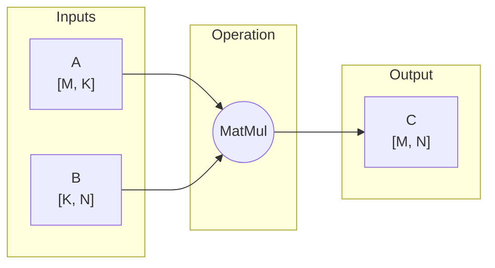

# Matrix Multiplication Tutorial

Matrix multiplication (GEMM) is fundamental to neural networks. This tutorial covers everything from basic matmul to advanced fusions.

## The Basics

Matrix multiplication computes `C = A @ B`:



## Basic Matrix Multiplication

```python
import cudnn
import torch

torch.manual_seed(42)
device = torch.device("cuda")
handle = cudnn.create_handle()

# Matrix A: [M=512, K=256]
A = torch.randn(512, 256, device=device, dtype=torch.float16)

# Matrix B: [K=256, N=1024]
B = torch.randn(256, 1024, device=device, dtype=torch.float16)

# Build matmul graph
with cudnn.Graph(
    io_data_type=cudnn.data_type.HALF,
    compute_data_type=cudnn.data_type.FLOAT,  # FP32 accumulation
) as graph:
    C = graph.matmul(A=A, B=B)
    C.set_output(True)

# Execute
result = graph(A, B, handle=handle)
print(f"Result shape: {result.shape}")  # [512, 1024]

# Verify
torch.testing.assert_close(result, A @ B, atol=1e-2, rtol=1e-2)
```

## Batched Matrix Multiplication

Process multiple matrices simultaneously:

```python
# Batched matmul: [Batch, M, K] @ [Batch, K, N] = [Batch, M, N]
batch_size = 32
A_batched = torch.randn(batch_size, 512, 256, device=device, dtype=torch.float16)
B_batched = torch.randn(batch_size, 256, 1024, device=device, dtype=torch.float16)

with cudnn.Graph(
    io_data_type=cudnn.data_type.HALF,
    compute_data_type=cudnn.data_type.FLOAT,
) as graph:
    C = graph.matmul(A=A_batched, B=B_batched)
    C.set_output(True)

result = graph(A_batched, B_batched, handle=handle)
print(f"Batched result shape: {result.shape}")  # [32, 512, 1024]
```

## Matmul with Bias (GEMM + Bias)

Common pattern in linear layers:

```python
# Linear layer: y = x @ W + b
x = torch.randn(32, 512, 256, device=device, dtype=torch.float16)  # [B, N, in_features]
W = torch.randn(256, 1024, device=device, dtype=torch.float16)     # [in_features, out_features]
bias = torch.randn(1024, device=device, dtype=torch.float16)       # [out_features]

with cudnn.Graph(
    io_data_type=cudnn.data_type.HALF,
    compute_data_type=cudnn.data_type.FLOAT,
) as graph:
    # Matmul
    mm_out = graph.matmul(A=x, B=W)

    # Add bias (broadcast)
    bias_reshaped = bias.unsqueeze(0).unsqueeze(0)  # [1, 1, out_features]
    out = graph.add(a=mm_out, b=bias_reshaped)
    out.set_output(True)

result = graph(x, W, bias_reshaped, handle=handle)
```

## Matmul with Activation

Fuse activation for better performance:

```python
with cudnn.Graph(
    io_data_type=cudnn.data_type.HALF,
    compute_data_type=cudnn.data_type.FLOAT,
) as graph:
    mm_out = graph.matmul(A=x, B=W)
    bias_out = graph.add(mm_out, bias_reshaped)

    # Add activation - all fused!
    gelu_out = graph.gelu(bias_out)  # Or: relu, silu, tanh
    gelu_out.set_output(True)

result = graph(x, W, bias_reshaped, handle=handle)
```

## Transposed Matrix Multiplication

For different contraction patterns:

```python
# C = A @ B.T
# When B is stored as [N, K] but you need [K, N]

A = torch.randn(512, 256, device=device, dtype=torch.float16)
B_T = torch.randn(1024, 256, device=device, dtype=torch.float16)  # Stored transposed

with cudnn.Graph() as graph:
    # Use B's transpose
    C = graph.matmul(A=A, B=B_T.T)  # cuDNN handles the transpose
    C.set_output(True)
```

## FP8 Matrix Multiplication

For maximum performance on Hopper GPUs:

```python
# FP8 requires scaling factors
A_fp8 = A.to(torch.float8_e4m3fn)
B_fp8 = B.to(torch.float8_e4m3fn)
scale_A = torch.tensor([1.0], device=device)
scale_B = torch.tensor([1.0], device=device)

with cudnn.Graph(
    io_data_type=cudnn.data_type.FP8_E4M3,
    compute_data_type=cudnn.data_type.FLOAT,
) as graph:
    C = graph.matmul(
        A=A_fp8, B=B_fp8,
        scale_A=scale_A,
        scale_B=scale_B,
    )
    C.set_output(True).set_data_type(cudnn.data_type.HALF)  # Output in FP16
```

## Multi-Head Attention Projections

Efficient Q, K, V projections:

```python
# Input: [batch, seq_len, hidden_dim]
# Projections: [hidden_dim, num_heads * head_dim]

batch, seq_len, hidden_dim = 8, 1024, 768
num_heads, head_dim = 12, 64

x = torch.randn(batch, seq_len, hidden_dim, device=device, dtype=torch.float16)
W_q = torch.randn(hidden_dim, num_heads * head_dim, device=device, dtype=torch.float16)
W_k = torch.randn(hidden_dim, num_heads * head_dim, device=device, dtype=torch.float16)
W_v = torch.randn(hidden_dim, num_heads * head_dim, device=device, dtype=torch.float16)

# Option 1: Separate projections
with cudnn.Graph() as q_graph:
    q = q_graph.matmul(x, W_q)
    q.set_output(True)

with cudnn.Graph() as k_graph:
    k = k_graph.matmul(x, W_k)
    k.set_output(True)

with cudnn.Graph() as v_graph:
    v = v_graph.matmul(x, W_v)
    v.set_output(True)

# Execute
Q = q_graph(x, W_q, handle=handle)
K = k_graph(x, W_k, handle=handle)
V = v_graph(x, W_v, handle=handle)
```

## Fused QKV Projection

More efficient - single matmul for all projections:

```python
# Fused weights: [hidden_dim, 3 * num_heads * head_dim]
W_qkv = torch.randn(hidden_dim, 3 * num_heads * head_dim,
                     device=device, dtype=torch.float16)

with cudnn.Graph() as graph:
    qkv = graph.matmul(x, W_qkv)
    qkv.set_output(True)

# Single matmul, then split
qkv_out = graph(x, W_qkv, handle=handle)
Q, K, V = qkv_out.chunk(3, dim=-1)

# Reshape for attention: [batch, seq_len, num_heads, head_dim] → [batch, num_heads, seq_len, head_dim]
Q = Q.view(batch, seq_len, num_heads, head_dim).transpose(1, 2)
K = K.view(batch, seq_len, num_heads, head_dim).transpose(1, 2)
V = V.view(batch, seq_len, num_heads, head_dim).transpose(1, 2)
```

## Feed-Forward Network (FFN)

The two-layer MLP in transformers:

```python
# FFN: x → Linear1 → Activation → Linear2
# Shapes: [B, N, D] → [B, N, 4D] → [B, N, D]

hidden_dim = 768
ff_dim = 768 * 4  # Typical 4x expansion

x = torch.randn(8, 1024, hidden_dim, device=device, dtype=torch.float16)
W1 = torch.randn(hidden_dim, ff_dim, device=device, dtype=torch.float16)
W2 = torch.randn(ff_dim, hidden_dim, device=device, dtype=torch.float16)

with cudnn.Graph() as graph:
    # First linear + GELU
    h = graph.matmul(x, W1)
    h = graph.gelu(h)

    # Second linear
    out = graph.matmul(h, W2)
    out.set_output(True)

result = graph(x, W1, W2, handle=handle)
```

## SwiGLU Activation

Popular in LLaMA and other modern architectures:

```python
# SwiGLU: (x @ W_gate * silu(x @ W_up)) @ W_down

W_gate = torch.randn(hidden_dim, ff_dim, device=device, dtype=torch.float16)
W_up = torch.randn(hidden_dim, ff_dim, device=device, dtype=torch.float16)
W_down = torch.randn(ff_dim, hidden_dim, device=device, dtype=torch.float16)

with cudnn.Graph() as graph:
    # Parallel projections
    gate = graph.matmul(x, W_gate)
    up = graph.matmul(x, W_up)

    # SwiGLU
    gate_activated = graph.silu(gate)
    gated = graph.mul(up, gate_activated)

    # Down projection
    out = graph.matmul(gated, W_down)
    out.set_output(True)

result = graph(x, W_gate, W_up, W_down, handle=handle)
```

## Mixed Precision Strategies

```python
# Strategy 1: FP16 everything with FP32 accumulation
with cudnn.Graph(
    io_data_type=cudnn.data_type.HALF,
    compute_data_type=cudnn.data_type.FLOAT,
) as graph:
    C = graph.matmul(A, B)

# Strategy 2: Mixed input types
A_fp16 = A.half()
B_bf16 = B.bfloat16()

with cudnn.Graph(
    compute_data_type=cudnn.data_type.FLOAT,
) as graph:
    C = graph.matmul(A=A_fp16, B=B_bf16)  # Inputs can differ
```

## Performance Comparison

| Configuration | Relative Speed | Memory |
|--------------|----------------|--------|
| FP32 I/O, FP32 compute | 1.0x | High |
| FP16 I/O, FP32 compute | 2-3x | Medium |
| FP16 I/O, FP16 compute | 3-4x | Low |
| FP8 I/O, FP32 compute | 4-6x | Very Low |

## Best Practices

!!! tip "Matmul Optimization"

    1. **Use FP16/BF16** for inputs when possible
    2. **Keep FP32 accumulation** for training stability
    3. **Align dimensions** to multiples of 8 (for Tensor Cores)
    4. **Fuse operations** - bias, activation, etc.
    5. **Batch operations** when possible

## Verification

```python
# Always verify numerical accuracy
with cudnn.Graph() as graph:
    C = graph.matmul(A, B)
    C.set_output(True)

cudnn_result = graph(A, B, handle=handle)
torch_result = torch.matmul(A, B)

torch.testing.assert_close(cudnn_result, torch_result, atol=1e-2, rtol=1e-2)
```

## Cleanup

```python
cudnn.destroy_handle(handle)
```

## Next Steps

Learn about the powerful scaled dot-product attention operation.

[Attention (SDPA) Tutorial :material-arrow-right:](attention.md){ .md-button .md-button--primary }
