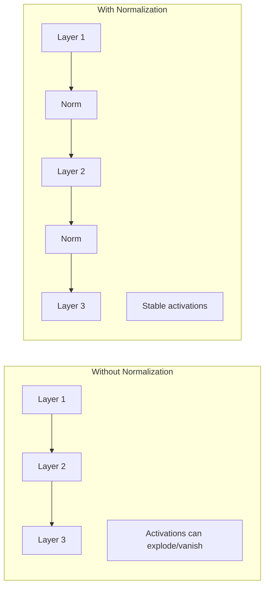

# Normalization Layers Tutorial

Normalization is crucial for stable training. This tutorial covers all normalization operations in cuDNN Frontend.

## Why Normalize?

Normalization helps with:

- **Training stability**: Prevents gradients from exploding/vanishing
- **Faster convergence**: Allows higher learning rates
- **Better generalization**: Acts as regularization



## Layer Normalization

The default normalization for transformers. Normalizes across the feature dimension.

### Forward (Training)

```python
import cudnn
import torch

torch.manual_seed(42)
device = torch.device("cuda")
handle = cudnn.create_handle()

# Input: [batch, seq_len, hidden_dim]
batch, seq_len, hidden_dim = 8, 512, 768

x = torch.randn(batch, seq_len, hidden_dim, device=device, dtype=torch.float16)
gamma = torch.ones(hidden_dim, device=device, dtype=torch.float32)  # Scale
beta = torch.zeros(hidden_dim, device=device, dtype=torch.float32)  # Bias
epsilon = 1e-5

with cudnn.Graph(
    io_data_type=cudnn.data_type.HALF,
    compute_data_type=cudnn.data_type.FLOAT,
) as graph:
    y, mean, inv_var = graph.layernorm(
        input=x,
        scale=gamma,
        bias=beta,
        epsilon=epsilon,
    )
    y.set_output(True)
    mean.set_output(True)   # Save for backward pass
    inv_var.set_output(True)  # Save for backward pass

# Execute
output, saved_mean, saved_inv_var = graph(x, gamma, beta, handle=handle)
print(f"Output shape: {output.shape}")  # [8, 512, 768]

# Verify
reference = torch.nn.functional.layer_norm(
    x.float(), [hidden_dim], gamma, beta, epsilon
).half()
torch.testing.assert_close(output, reference, atol=1e-2, rtol=1e-2)
```

### Forward (Inference)

For inference, no need to save statistics:

```python
with cudnn.Graph(
    io_data_type=cudnn.data_type.HALF,
    compute_data_type=cudnn.data_type.FLOAT,
) as graph:
    y, _, _ = graph.layernorm(
        input=x,
        scale=gamma,
        bias=beta,
        epsilon=epsilon,
    )
    y.set_output(True)

output = graph(x, gamma, beta, handle=handle)
```

### Backward

```python
# Gradient from next layer
dy = torch.randn_like(output)

with cudnn.Graph(
    io_data_type=cudnn.data_type.HALF,
    compute_data_type=cudnn.data_type.FLOAT,
) as bwd_graph:
    dx, dgamma, dbeta = bwd_graph.layernorm_backward(
        dy=dy,
        x=x,
        scale=gamma,
        mean=saved_mean,
        inv_var=saved_inv_var,
        epsilon=epsilon,
    )
    dx.set_output(True)
    dgamma.set_output(True)
    dbeta.set_output(True)

dx_out, dgamma_out, dbeta_out = bwd_graph(dy, x, gamma, saved_mean, saved_inv_var, handle=handle)
```

## RMS Normalization

Used in LLaMA, Mistral, and other modern LLMs. Simpler than LayerNorm - no centering.

$$\text{RMSNorm}(x) = \frac{x}{\sqrt{\frac{1}{d}\sum_i x_i^2 + \epsilon}} \cdot \gamma$$

```python
with cudnn.Graph(
    io_data_type=cudnn.data_type.HALF,
    compute_data_type=cudnn.data_type.FLOAT,
) as graph:
    y, inv_rms = graph.rmsnorm(
        input=x,
        scale=gamma,
        epsilon=epsilon,
    )
    y.set_output(True)

output = graph(x, gamma, handle=handle)

# Manual verification
def rms_norm_ref(x, gamma, eps):
    variance = x.float().pow(2).mean(-1, keepdim=True)
    x_normed = x.float() * torch.rsqrt(variance + eps)
    return (x_normed * gamma).half()

reference = rms_norm_ref(x, gamma, epsilon)
torch.testing.assert_close(output, reference, atol=1e-2, rtol=1e-2)
```

## Batch Normalization

Traditional CNN normalization. Normalizes across the batch dimension.

### Training

```python
# Input: [N, C, H, W] - image format
x_conv = torch.randn(32, 64, 28, 28, device=device, dtype=torch.float16).to(
    memory_format=torch.channels_last
)

# Per-channel parameters
num_channels = 64
gamma_bn = torch.ones(num_channels, device=device, dtype=torch.float32)
beta_bn = torch.zeros(num_channels, device=device, dtype=torch.float32)
running_mean = torch.zeros(num_channels, device=device, dtype=torch.float32)
running_var = torch.ones(num_channels, device=device, dtype=torch.float32)
momentum = 0.1
epsilon = 1e-5

with cudnn.Graph(
    io_data_type=cudnn.data_type.HALF,
    compute_data_type=cudnn.data_type.FLOAT,
) as graph:
    y, new_running_mean, new_running_var, saved_mean, saved_inv_var = graph.batchnorm(
        input=x_conv,
        scale=gamma_bn,
        bias=beta_bn,
        running_mean=running_mean,
        running_var=running_var,
        momentum=momentum,
        epsilon=epsilon,
    )
    y.set_output(True)
    new_running_mean.set_output(True)
    new_running_var.set_output(True)
```

### Inference

Use frozen running statistics:

```python
# Precompute inverse variance
inv_variance = 1.0 / torch.sqrt(running_var + epsilon)

with cudnn.Graph(
    io_data_type=cudnn.data_type.HALF,
    compute_data_type=cudnn.data_type.FLOAT,
) as graph:
    y = graph.batchnorm_inference(
        input=x_conv,
        scale=gamma_bn,
        bias=beta_bn,
        mean=running_mean,
        inv_variance=inv_variance,
    )
    y.set_output(True)

output = graph(x_conv, gamma_bn, beta_bn, running_mean, inv_variance, handle=handle)
```

## Instance Normalization

Normalizes each sample independently. Used in style transfer.

```python
with cudnn.Graph() as graph:
    y = graph.instancenorm(
        input=x_conv,
        scale=gamma_bn,
        bias=beta_bn,
        epsilon=epsilon,
    )
    y.set_output(True)
```

## Group Normalization

Hybrid between Layer and Instance norm. Divides channels into groups.

```python
num_groups = 32  # Typically 32 groups
channels_per_group = num_channels // num_groups

# GroupNorm can be implemented using LayerNorm with reshaping
# or using the dedicated API if available
```

## Fused Operations

Combine normalization with other operations for maximum performance.

### LayerNorm + Dropout

```python
dropout_prob = 0.1

with cudnn.Graph() as graph:
    y, mean, inv_var = graph.layernorm(x, gamma, beta, epsilon)
    y_dropped = graph.dropout(y, prob=dropout_prob)
    y_dropped.set_output(True)
```

### LayerNorm + Residual Add

```python
residual = torch.randn_like(x)

with cudnn.Graph() as graph:
    y, _, _ = graph.layernorm(x, gamma, beta, epsilon)
    out = graph.add(y, residual)
    out.set_output(True)
```

### Pre-Norm Transformer Block Pattern

```python
def pre_norm_block(graph, x, ln_gamma, ln_beta, attn_weights, ff_weights):
    """
    Pre-norm pattern: LayerNorm before attention/FFN
    """
    # First sub-layer
    residual = x
    x = graph.layernorm(x, ln_gamma, ln_beta, 1e-5)[0]
    x = attention(graph, x, attn_weights)  # Your attention implementation
    x = graph.add(residual, x)

    # Second sub-layer
    residual = x
    x = graph.layernorm(x, ln_gamma, ln_beta, 1e-5)[0]
    x = ffn(graph, x, ff_weights)  # Your FFN implementation
    x = graph.add(residual, x)

    return x
```

## Zero-Centered Gamma

Some architectures use `(1 + gamma)` instead of `gamma`:

```python
# gamma starts at 0, effective scale is (1 + gamma)
gamma_centered = torch.zeros(hidden_dim, device=device, dtype=torch.float32)

with cudnn.Graph() as graph:
    y, _, _ = graph.layernorm(
        input=x,
        scale=gamma_centered,
        bias=beta,
        epsilon=epsilon,
        zero_centered_gamma=True,  # Enable this mode
    )
    y.set_output(True)
```

## Numerical Precision

Normalization is precision-sensitive:

```python
# RECOMMENDED: FP32 computation for stability
with cudnn.Graph(
    io_data_type=cudnn.data_type.HALF,      # FP16 I/O
    compute_data_type=cudnn.data_type.FLOAT, # FP32 computation
) as graph:
    y, mean, inv_var = graph.layernorm(x, gamma, beta, epsilon)
```

!!! warning "Numerical Stability"
    Always use FP32 computation for normalization, even with FP16 inputs. The division and square root operations are very sensitive to precision.

## Performance Comparison

| Normalization | Typical Use | Parallelism | Memory |
|--------------|-------------|-------------|--------|
| BatchNorm | CNNs | Across batch | Low |
| LayerNorm | Transformers | Within sample | Medium |
| RMSNorm | Modern LLMs | Within sample | Low |
| GroupNorm | Small batch | Within sample | Medium |
| InstanceNorm | Style transfer | Within sample | Medium |

## Complete Example: Transformer Layer

```python
class TransformerLayerNorm:
    def __init__(self, hidden_dim, handle):
        self.hidden_dim = hidden_dim
        self.handle = handle

        # LayerNorm parameters
        self.gamma = torch.ones(hidden_dim, device="cuda", dtype=torch.float32)
        self.beta = torch.zeros(hidden_dim, device="cuda", dtype=torch.float32)
        self.epsilon = 1e-5

    def forward_training(self, x):
        with cudnn.Graph(
            io_data_type=cudnn.data_type.HALF,
            compute_data_type=cudnn.data_type.FLOAT,
        ) as graph:
            y, mean, inv_var = graph.layernorm(
                x, self.gamma, self.beta, self.epsilon
            )
            y.set_output(True)
            mean.set_output(True)
            inv_var.set_output(True)

        return graph(x, self.gamma, self.beta, handle=self.handle)

    def forward_inference(self, x):
        with cudnn.Graph(
            io_data_type=cudnn.data_type.HALF,
            compute_data_type=cudnn.data_type.FLOAT,
        ) as graph:
            y, _, _ = graph.layernorm(
                x, self.gamma, self.beta, self.epsilon
            )
            y.set_output(True)

        return graph(x, self.gamma, self.beta, handle=self.handle)
```

## Cleanup

```python
cudnn.destroy_handle(handle)
```

## Next Steps

Learn how to build custom computation graphs.

[Custom Graphs Tutorial :material-arrow-right:](custom-graphs.md){ .md-button .md-button--primary }
